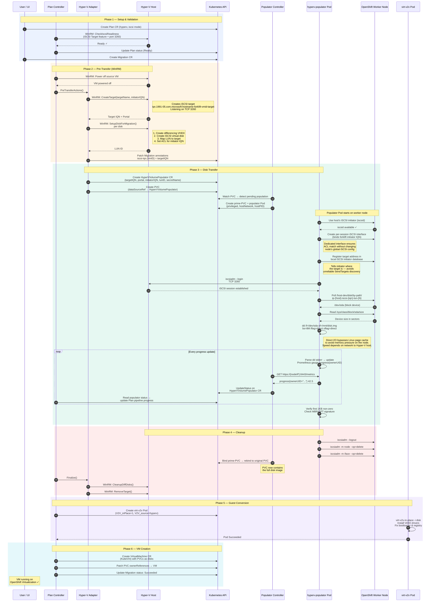
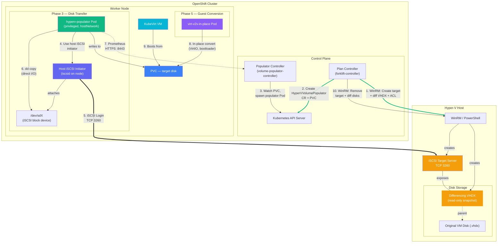

# Hyper-V iSCSI Migration Flow

## Sequence Diagram

## Component Diagram

## Network Calls Summary

| Protocol | From | To | Purpose |
|----------|------|----|---------|
| WinRM/HTTPS | Plan Controller | Hyper-V Host | Target setup, teardown, readiness checks |
| iSCSI (TCP 3260) | Worker Node (hostNetwork) | Hyper-V Portal | Block-level disk data transfer |
| HTTPS :8443 | Populator Controller | Worker Node PodIP | Prometheus metrics scrape (progress) |
| Kubernetes API | All controllers | kube-apiserver | CR CRUD, PVC binding, Pod lifecycle |
