# HyperV Provider Server Deployment Flow

## Complete Architecture Diagram

```mermaid
flowchart LR
    subgraph UserPhase["User Phase"]
        User[User/Administrator] -->|Creates| ProviderCR["Provider CR<br/>spec.url: 192.168.1.100<br/>spec.type: hyperv"]
        User -->|Creates| Secret["Secret<br/>username, password<br/>smbUrl, insecureSkipVerify, cacert"]
    end
    
    subgraph ProviderReconciler["Provider Reconciler"]
        ProvCtrl["Provider Reconciler<br/>Watches Provider CRs"] -->|Detects HyperV provider| EnsureServer["EnsureHyperVProviderServer()<br/>hyperv-setup.go"]
        EnsureServer -->|Creates| ServerCR["HyperVProviderServer CR<br/>(intermediate resource)"]
    end

    subgraph HyperVReconciler["HyperV Server Reconciler"]
        HyperVCtrl["HyperV Reconciler<br/>Watches HyperVProviderServer CRs"] -->|Detects CR| Deploy["Deploy()<br/>controller.go:152"]
        Deploy -->|Reads Provider CR & Secret| BuildDeployment["builder.go:Deployment()<br/>Creates Deployment object"]
        BuildDeployment -->|Calls| PodSpec["builder.go:PodSpec()<br/>Sets Environment Variables:<br/>HYPERV_URL, HYPERV_USERNAME,<br/>HYPERV_PASSWORD, SMB_URL<br/>TLS settings via /etc/secret/"]
    end
    
    subgraph K8sPhase["Kubernetes Control Plane"]
        Deployment["Deployment"] -->|Creates| ReplicaSet["ReplicaSet"]
        ReplicaSet -->|Creates| Pod["Pod<br/>with env vars from PodSpec"]
        Pod -->|Schedules| Scheduler["Scheduler<br/>Assigns to worker node"]
    end
    
    subgraph NodePhase["Worker Node"]
        Kubelet["Kubelet<br/>Pulls image, creates container,<br/>sets env vars, starts process"] -->|Starts| HyperVServer["HyperV Provider Server Pod<br/>main.go:LoadHyperV()<br/>Reads Environment Variables<br/>Starts Services"]
    end
    
    subgraph Runtime["Runtime"]
        Services["Services Running:<br/>HTTP Server :8080<br/>Collector<br/>WinRM Connections"] -->|Connects| HyperVHost["HyperV Host<br/>via WinRM"]
    end
    
    UserPhase -->|Stored in K8s API| ProviderReconciler
    ProviderReconciler -->|Creates CR| HyperVReconciler
    HyperVReconciler -->|Creates Deployment| K8sPhase
    K8sPhase -->|Schedules Pod| NodePhase
    NodePhase -->|Running| Runtime
    
    style UserPhase fill:#e1f5ff,stroke:#333,stroke-width:2px,color:#000
    style ProviderReconciler fill:#fff4e1,stroke:#333,stroke-width:2px,color:#000
    style HyperVReconciler fill:#ffe0b2,stroke:#333,stroke-width:2px,color:#000
    style K8sPhase fill:#e8f5e9,stroke:#333,stroke-width:2px,color:#000
    style NodePhase fill:#f3e5f5,stroke:#333,stroke-width:2px,color:#000
    style Runtime fill:#e8f5e9,stroke:#333,stroke-width:2px,color:#000
    style HyperVHost fill:#ffebee,stroke:#333,stroke-width:2px,color:#000
    style User fill:#fff,stroke:#333,color:#000
    style ProviderCR fill:#fff,stroke:#333,color:#000
    style Secret fill:#fff,stroke:#333,color:#000
    style ProvCtrl fill:#fff,stroke:#333,color:#000
    style EnsureServer fill:#fff,stroke:#333,color:#000
    style ServerCR fill:#fff,stroke:#333,color:#000
    style HyperVCtrl fill:#fff,stroke:#333,color:#000
    style Deploy fill:#fff,stroke:#333,color:#000
    style BuildDeployment fill:#fff,stroke:#333,color:#000
    style PodSpec fill:#fff,stroke:#333,color:#000
    style Deployment fill:#fff,stroke:#333,color:#000
    style ReplicaSet fill:#fff,stroke:#333,color:#000
    style Pod fill:#fff,stroke:#333,color:#000
    style Scheduler fill:#fff,stroke:#333,color:#000
    style Kubelet fill:#fff,stroke:#333,color:#000
    style HyperVServer fill:#fff,stroke:#333,color:#000
    style Services fill:#fff,stroke:#333,color:#000
```



## Key Points

### Phase 1: User Phase
- **User creates** Provider CR with HyperV host address (`spec.url`, e.g. `192.168.1.100`)
- **User creates** Secret with credentials (`username`, `password`, `smbUrl`, `insecureSkipVerify`, `cacert`)
- Both resources are stored in Kubernetes API (etcd)

### Phase 2: Provider Reconciler
- The **Provider Reconciler** (`pkg/controller/provider/controller.go`) watches for `Provider` CRs
- When it detects a Provider with `type: hyperv`, it calls `EnsureHyperVProviderServer()` (`pkg/controller/provider/hyperv-setup.go`)
- This creates a **`HyperVProviderServer` CR** -- an intermediate custom resource that acts as the handoff between the two controllers
- The Provider Reconciler also copies status (e.g. service endpoint) back from the `HyperVProviderServer` to the `Provider` status

### Phase 3: HyperV Server Reconciler
- The **HyperV Server Reconciler** (`pkg/controller/hyperv/controller.go`) watches for `HyperVProviderServer` CRs
- When it detects one, its `Reconcile()` method calls `Deploy()` (line 102)
- `Deploy()` reads the referenced Provider CR and its Secret, then builds a Deployment via `builder.go`:
  - `builder.go:Deployment()` creates the Deployment object
  - `builder.go:PodSpec()` sets environment variables:
    - `HYPERV_URL` from `provider.Spec.URL`
    - `HYPERV_USERNAME` from `secret["username"]`
    - `HYPERV_PASSWORD` from `secret["password"]`
    - `SMB_URL` from `secret["smbUrl"]`
    - TLS settings (`insecureSkipVerify`, `cacert`) read from mounted secret at `/etc/secret/`
- The Deployment resource is written to the Kubernetes API

### Phase 4: Kubernetes Control Plane
- **Deployment Controller** creates a ReplicaSet to ensure desired replicas
- **ReplicaSet Controller** creates Pod with environment variables from PodSpec
- **Kubernetes Scheduler** evaluates nodes and assigns Pod to a worker node
- Environment variables are already part of Pod spec (set by HyperV Server Reconciler)

### Phase 5: Worker Node
- **Kubelet** on the worker node receives the scheduled Pod
- **Kubelet** pulls the container image, creates the container, sets environment variables, and starts the process
- **HyperV Provider Server** starts and reads environment variables via `main.go:LoadHyperV()`
- **HyperV Server** starts services: HTTP server (port 8080), Collector, WinRM connections

### Phase 6: Runtime
- **HyperV Provider Server** is fully operational
- **HTTP Server** serves inventory API on port 8080
- **Collector** periodically refreshes inventory from HyperV host
- **WinRM connections** are established to HyperV host using credentials from environment variables
- **Server connects** to HyperV Host via WinRM for inventory collection and VM management

## Controller Handoff Pattern

This follows the standard Kubernetes "controller chain" pattern:

```
Provider CR (user-created)
  --> Provider Reconciler creates HyperVProviderServer CR
    --> HyperV Server Reconciler creates Deployment
      --> Kubernetes creates ReplicaSet --> Pod
```

The `HyperVProviderServer` CR is the handoff object between the two controllers. This separation allows:
- The Provider Reconciler to handle all provider types (vSphere, oVirt, OVA, HyperV, etc.) uniformly
- The HyperV Server Reconciler to focus solely on managing the HyperV provider server lifecycle

## Environment Variable Mapping

| Environment Variable | Source | Location |
|---------------------|--------|----------|
| `HYPERV_URL` | `provider.Spec.URL` | builder.go:268 |
| `HYPERV_USERNAME` | `secret["username"]` | builder.go:286 |
| `HYPERV_PASSWORD` | `secret["password"]` | builder.go:297 |
| `SMB_URL` | `secret["smbUrl"]` | builder.go:273 |

### TLS Configuration (read from mounted secret at `/etc/secret/`)

| File | Purpose |
|------|---------|
| `/etc/secret/insecureSkipVerify` | If "true", skip TLS certificate verification |
| `/etc/secret/cacert` | PEM-encoded CA certificate for TLS verification |

## Code References

- **Provider Reconciler**: `pkg/controller/provider/controller.go` - watches Provider CRs
- **HyperV Server Ensure**: `pkg/controller/provider/hyperv-setup.go:15` - `EnsureHyperVProviderServer()`
- **HyperV Server Reconciler**: `pkg/controller/hyperv/controller.go:70` - `Reconcile()`
- **Deploy**: `pkg/controller/hyperv/controller.go:152` - `Deploy()`
- **Builder**: `pkg/controller/hyperv/builder.go:190` - `Deployment()`
- **PodSpec**: `pkg/controller/hyperv/builder.go:213` - `PodSpec()`
- **Env Vars**: `pkg/controller/hyperv/builder.go:245-312` - Environment variable setup
- **Server Main**: `cmd/hyperv-provider-server/main.go:39` - `LoadHyperV()`
- **Settings**: `cmd/provider-common/settings/settings.go:110` - `LoadHyperV()`
