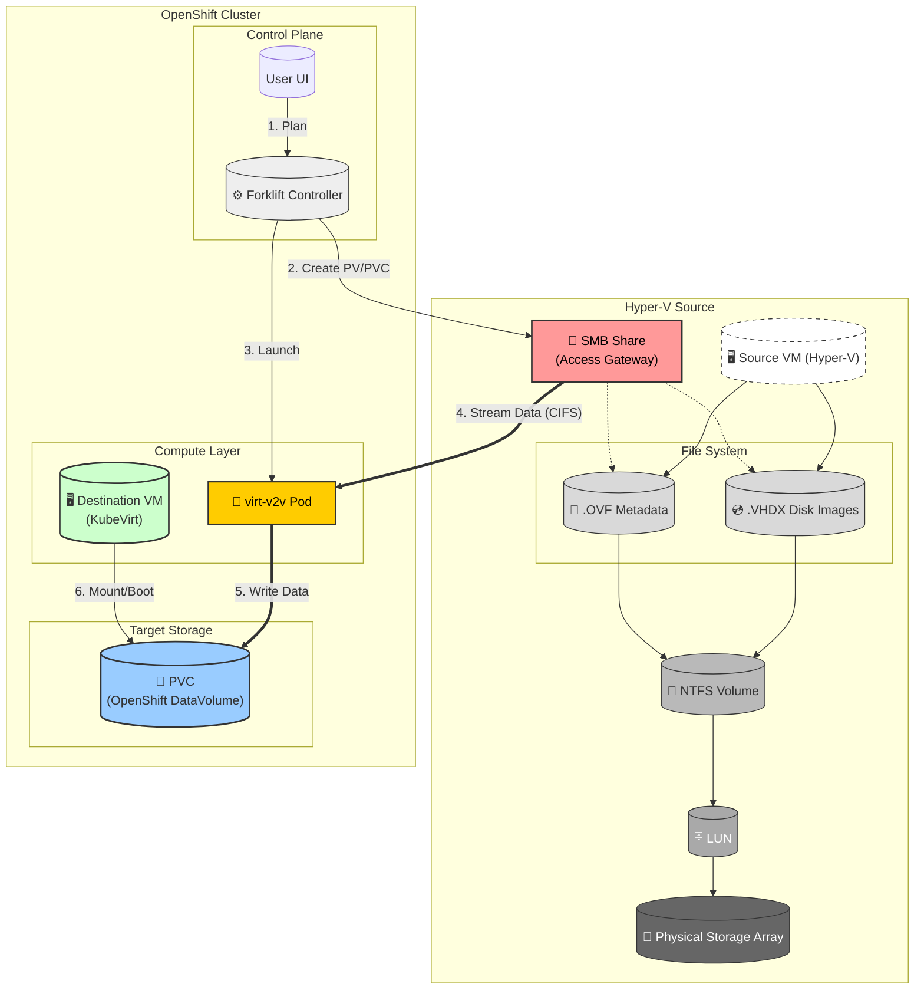
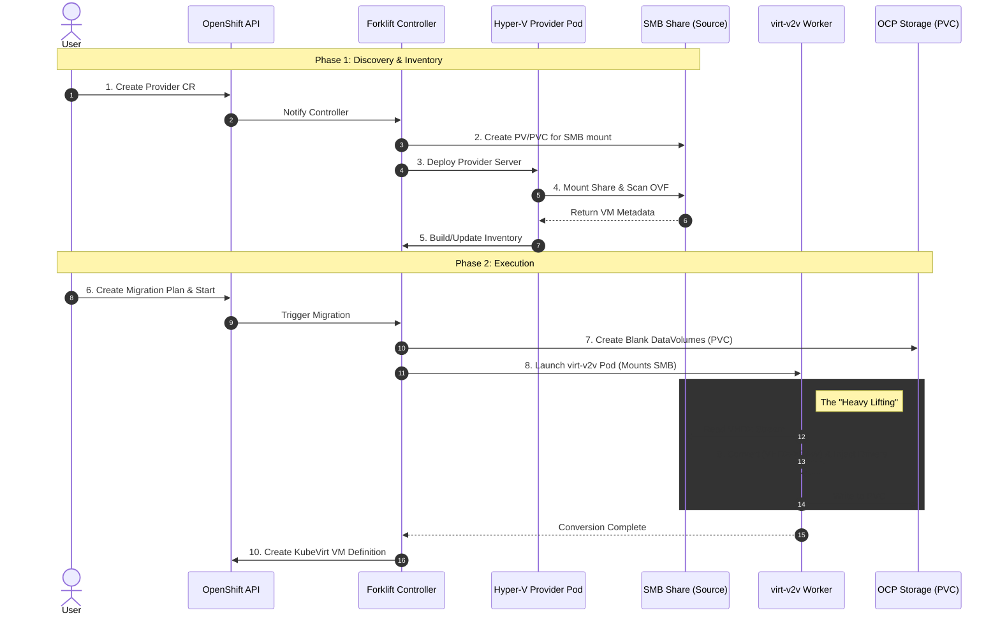
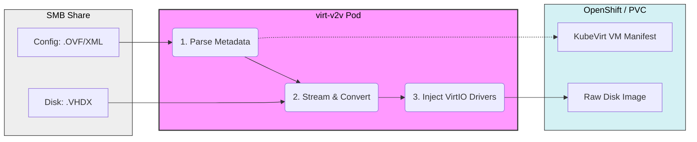

# Hyper-V to OpenShift Virtualization Migration
## Presentation Slides

---

## Slide 1: Why Migrate from Hyper-V?

### Microsoft's Shifting Strategy
- **Hyper-V has no future roadmap** — Microsoft is pushing customers toward Azure
- **Performance issues** — Known performance problems with Hyper-V at scale

### The Opportunity
- **No existing migration tooling** — No open-source solution existed before Forklift
- **Customers are stuck** — Want to modernize but lack a migration path
- **OpenShift Virtualization** — Provides a modern, cloud-native alternative

### Real Customer Demand

| Customer | Scale | Status |
|----------|-------|--------|
| **Paychex** | **20,000+ VMs** on Hyper-V | Evaluating migration |
| **Wesco** | **5,600 VMs** on Hyper-V | Seeking solution |

### Why OpenShift?
- **Unified platform**: Run VMs and containers side-by-side
- **No hypervisor licensing**: Reduce infrastructure costs
- **Cloud-native path**: Modernize VMs → containers over time
- **Kubernetes ecosystem**: Leverage existing tooling and skills

---

## Slide 2: Challenges with Hyper-V Migration

### No Direct API Access

```
┌─────────────────────────────────────────────────────────┐
│           The Hyper-V API Problem                       │
├─────────────────────────────────────────────────────────┤
│  vSphere/oVirt:  API → Direct disk streaming           │
│  Hyper-V:        WMI → Windows-only, no Linux support  │
└─────────────────────────────────────────────────────────┘
```

- Hyper-V uses **WMI/PowerShell** - Windows-native protocols
- No equivalent to VMware VDDK or oVirt imageio
- No supported, Linux-native mechanism exists to stream Hyper-V VM disks at block-level

---

## Slide 3: What We Tried and Why It Failed

### Approach 1: WinRM (Windows Remote Management) ❌

```
Linux Pod ──WinRM──► Hyper-V Host ──► Execute PowerShell ──► Stream VHDX
```

**Why it failed:**
- WinRM requires **complex authentication** (Kerberos/NTLM/CredSSP)
- Streaming large VHDX over WinRM is **extremely slow** (SOAP/XML overhead)
- **No native Linux WinRM client** — pywinrm is fragile for long-running, high-volume transfers
- Security teams often **block WinRM** due to lateral movement concerns

> **Key insight:** WinRM is fine for control-plane operations, but not for data-plane streaming.

### Approach 2: SSH on Windows ❌

```
Linux Pod ──SSH/SCP──► Windows (OpenSSH) ──► Copy VHDX files
```

**Why it failed:**
- OpenSSH on Windows is **not consistently enabled or managed** in enterprise environments
- **Permission issues**: SSH user needs access to Hyper-V VM storage paths
- **Live VM handling**: Would need PowerShell to snapshot/checkpoint before copy — adds complexity
- Many customers have **Group Policy blocking SSH** on Windows servers

### Approach 3: Agent-Based ❌

```
Hyper-V Host ◄── Agent ──► OpenShift
```

**Why it failed:**
- Customers **refuse to install software** on production hypervisors
- **Security audit concerns** — agents need elevated privileges
- **Maintenance burden** — agent updates, compatibility issues

### Approach 4: Export + SMB File Share ✅ (Chosen Solution)

```
Hyper-V Host ──Export-VM──► SMB Share ◄──read-only── OpenShift
```

**Why it works:**
- Leverages **Hyper-V's native capabilities** (Export-VM or direct share of VM storage)
- **Separates control-plane** (admin prepares share) **from data-plane** (OpenShift reads files)
- **No long-lived credentials or agents** on hypervisors
- Reuses **battle-tested tooling** (SMB/CIFS, virt-v2v)
- Fits **existing enterprise operational models**

**Security benefits:**
- SMB share can be **temporary** (created per migration)
- Share can be **network-isolated** from production
- OpenShift access is **read-only**

---

## Slide 4: How VMware/OVA Import Works (Reference)

### The OVA Provider Pattern

```
┌──────────────┐     ┌──────────────┐     ┌──────────────────┐
│  VMware      │     │  NFS Share   │     │  OpenShift       │
│  Export OVA  │────►│  .ova files  │◄────│  Provider Server │
└──────────────┘     └──────────────┘     │  (scans OVF)     │
                                          └──────────────────┘
                                                   │
                                                   ▼
                                          ┌──────────────────┐
                                          │  virt-v2v Pod    │
                                          │  VMDK → RAW      │
                                          └──────────────────┘
```

### Key Components
1. **OVA file** = Tarball containing OVF (metadata) + VMDK (disks)
2. **NFS CSI driver** for mounting share into pods
3. **virt-v2v** reads OVF, converts VMDK → RAW, injects drivers
4. **DataVolume** receives converted disk

### Why This Pattern Works
- **Decoupled**: Export happens offline, migration happens when ready
- **Standard formats**: OVF is industry standard (DMTF)
- **Proven tooling**: virt-v2v handles conversion reliably

---

## Slide 5: Current HyperV Design - Architecture

### High-Level Flow

```
┌──────────────────────────────────────────────────────────────────────────────────────────────────────────┐
│                                  Hyper-V Migration Architecture                                           │
└──────────────────────────────────────────────────────────────────────────────────────────────────────────┘

┌───────────────────┐     ┌───────────────────┐     ┌───────────────────────────────────────────────────────┐
│  CUSTOMER INFRA   │     │  PROVIDER SERVER  │     │              FORKLIFT-CONTROLLER POD                  │
│                   │     │  POD              │     │  ┌───────────────────┐   ┌───────────────────────┐   │
│ ┌───────────────┐ │     │ ┌───────────────┐ │     │  │ INVENTORY         │   │ MAIN CONTAINER        │   │
│ │ HyperV Host   │ │     │ │ Mounts SMB    │ │     │  │ CONTAINER         │   │                       │   │
│ │ (VMs stopped) │ │     │ │ via CSI PVC   │ │     │  │                   │   │ • Queries inventory   │   │
│ └───────┬───────┘ │     │ └───────┬───────┘ │     │  │ • Queries         │   │ • UI displays VMs     │   │
│         │         │     │         │         │     │  │   provider API    │   │ • Creates plans       │   │
│         ▼         │     │         ▼         │     │  │         │         │   │         │             │   │
│ ┌───────────────┐ │     │ ┌───────────────┐ │     │  │         ▼         │   │         │             │   │
│ │ VHDX files    │ │     │ │ Scans .ovf    │ │     │  │ SQLite storage    │◄──┤ localhost:8080        │   │
│ │ shared via    │ │     │ │ files         │ │     │  │         │         │   │                       │   │
│ │ SMB           │ │     │ └───────┬───────┘ │     │  │         ▼         │   └───────────┬───────────┘   │
│ └───────┬───────┘ │     │         │         │     │  │ REST API :8080    │               │               │
│         │         │     │         ▼         │     │  └───────────────────┘               │               │
│         ▼         │     │ ┌───────────────┐ │     └───────────────────────────────────────┼───────────────┘
│ ┌───────────────┐ │     │ │ HTTP API      │ │                                             │
│ │ OVF Generator │ │     │ │ :8080         │ │                                             │ Creates
│ │ generates     │ │     │ └───────────────┘ │                                             ▼
│ │ .ovf metadata │ │     │                   │     ┌───────────────────────────────────────────────────────┐
│ └───────────────┘ │     └─────────┬─────────┘     │                    CONVERSION POD (virt-v2v)          │
│                   │               │               │  ┌───────────────┐  ┌───────────────┐                 │
└─────────┬─────────┘               │               │  │ Mounts SMB    │──│ virt-v2v      │                 │
          │                         │               │  │ PVC           │  │ reads VHDX    │                 │
          │        SMB Share        │  K8s Service  │  └───────────────┘  └───────┬───────┘                 │
          └─────────────────────────►               │                             │                         │
          │                         ▲               │                             ▼                         │
          │                         └───────────────│────────────────────┌───────────────┐                 │
          │                                         │                    │ VHDX → QCOW2  │                 │
          └ ─ ─ ─ Direct SMB access ─ ─ ─ ─ ─ ─ ─ ─►│                    └───────────────┘                 │
                                                    └───────────────────────────────────────────────────────┘
```

### Component Summary

| Component | Role |
|-----------|------|
| **OVF Generator** | Creates metadata from Hyper-V (runs on Windows) |
| **SMB Share** | Stores exported VM files |
| **Provider Server** | Scans OVF, exposes inventory API |
| **Controller** | Orchestrates migration phases |
| **virt-v2v** | Converts VHDX → RAW, injects drivers |

### Data Flow Diagram



---

## Slide 6: OVF Generator Deep-Dive

### Why We Built It
- Hyper-V `Export-VM` creates **proprietary format** (XML config + VHDX) — **not OVF**
- virt-v2v expects **OVF format** for VM metadata
- Need accurate metadata: OS info, disk virtual sizes, hardware configuration
- **Agentless**: runs on admin workstation, queries Hyper-V WMI remotely

### How It Works

```
┌────────────────────────────────────────────────────────────────┐
│                    OVF Generator Flow                          │
└────────────────────────────────────────────────────────────────┘

┌──────────────────┐     ┌──────────────────┐     ┌──────────────┐
│  PowerShell      │     │  WMI/KVP         │     │  VHDX Parser │
│  Get-VM          │────►│  Guest OS Info   │────►│  Virtual Size│
└──────────────────┘     └──────────────────┘     └──────────────┘
         │                        │                       │
         └────────────────────────┼───────────────────────┘
                                  ▼
                         ┌──────────────────┐
                         │   OVF XML File   │
                         │  - CPU/Memory    │
                         │  - OS Type       │
                         │  - Disk Sizes    │
                         │  - Controllers   │
                         └──────────────────┘
```

### Key Technical Details

**1. VM Configuration via PowerShell:**
```powershell
Get-VM -Name "MyVM" | Select-Object Name, ProcessorCount, MemoryStartup
Get-VMHardDiskDrive -VMName "MyVM" | Select-Object Path, ControllerType
```

**2. Guest OS Detection (Agentless via KVP Exchange):**

> **KVP (Key-Value Pair) Exchange** is a Hyper-V Integration Service that enables
> host-guest communication via VMbus — no network required. The guest OS reports
> its name, version, and other metadata to the hypervisor automatically.

```
┌─────────────────────────────────────────────────────────────────────┐
│                    KVP Exchange Data Flow                           │
├─────────────────────────────────────────────────────────────────────┤
│                                                                     │
│  ┌─────────────────────────┐        ┌─────────────────────────────┐ │
│  │      GUEST VM           │        │      HYPER-V HOST           │ │
│  │                         │        │                             │ │
│  │  ┌───────────────────┐  │        │  ┌───────────────────────┐  │ │
│  │  │ Integration       │  │ VMbus  │  │ WMI Provider          │  │ │
│  │  │ Services (built-in│◄─┼────────┼─►│ Msvm_KvpExchange      │  │ │
│  │  │ to Windows)       │  │        │  │ Component             │  │ │
│  │  └─────────┬─────────┘  │        │  └───────────┬───────────┘  │ │
│  │            │            │        │              │              │ │
│  │            ▼            │        │              ▼              │ │
│  │  ┌───────────────────┐  │        │  ┌───────────────────────┐  │ │
│  │  │ OS reports:       │  │        │  │ OVF Generator reads:  │  │ │
│  │  │ • OSName          │──┼────────┼─►│ • OSName              │  │ │
│  │  │ • OSVersion       │  │        │  │ • OSVersion           │  │ │
│  │  │ • Hostname        │  │        │  │ • Hostname            │  │ │
│  │  └───────────────────┘  │        │  └───────────────────────┘  │ │
│  │                         │        │                             │ │
│  └─────────────────────────┘        └─────────────────────────────┘ │
│                                                                     │
│  ✓ No agent installation     ✓ No network required                  │
│  ✓ Works with VM powered on  ✓ Built into Windows & Linux guests    │
│                                                                     │
└─────────────────────────────────────────────────────────────────────┘
```

**3. VHDX Virtual Size Extraction:**

> **Problem:** File size ≠ Virtual size (VHDX uses sparse/dynamic allocation)

```
┌─────────────────────────────────────────────────────────────────────┐
│                    VHDX File Structure                              │
├─────────────────────────────────────────────────────────────────────┤
│                                                                     │
│   disk.vhdx (file on disk)              Guest sees:                 │
│   ┌─────────────────────┐               ┌─────────────────────────┐ │
│   │ Header + Metadata   │──────────────►│                         │ │
│   │ (contains virtual   │               │    50 GB Virtual Disk   │ │
│   │  size: 50 GB)       │               │                         │ │
│   ├─────────────────────┤               │   (what Windows sees)   │ │
│   │ Allocated blocks    │               │                         │ │
│   │ (only 32 GB used)   │               └─────────────────────────┘ │
│   └─────────────────────┘                                           │
│         ▲                                                           │
│         │                                                           │
│   ls -l shows: 32 GB     ◄── WRONG for PVC sizing!                  │
│   Metadata says: 50 GB   ◄── CORRECT (we parse this)                │
│                                                                     │
└─────────────────────────────────────────────────────────────────────┘
```

---

## Slide 7: Migration Workflow (Sequence Diagram)

### Control Plane ↔ Data Plane Interaction



---

## Slide 8: virt-v2v Conversion Engine (Pipeline)

### What Happens Inside the Worker Pod



### virt-v2v Transformation Steps

| Step | Input | Output | Description |
|------|-------|--------|-------------|
| **1. Parse** | `.ovf` | VM Config | Extract CPU, RAM, disk, network settings |
| **2. Convert** | `.vhdx` | RAW | Stream VHDX, handle sparse/dynamic allocation |
| **3. Inject** | RAW | RAW + drivers | Replace Hyper-V tools with VirtIO drivers |
| **4. Write** | RAW | PVC | Write directly to OpenShift storage |

---

## Slide 9: Advantages

### Technical Advantages

| Advantage | Description |
|-----------|-------------|
| **Agentless** | No software installation on Hyper-V hosts |
| **Standard Formats** | Uses OVF/VHDX - documented, stable |
| **Proven Tooling** | Leverages virt-v2v (mature, battle-tested) |
| **SMB Native** | Works with existing Windows file shares |

### Business Advantages

| Advantage | Description |
|-----------|-------------|
| **First Open-Source** | No alternative exists for Hyper-V → K8s |
| **Low Barrier** | Uses skills admins already have (PowerShell, SMB) |
| **Non-Disruptive** | Export during maintenance, migrate at leisure |
| **Validation** | Pre-flight checks before committing resources |

---

## Slide 10: Disadvantages & Limitations

### Current Limitations

| Limitation | Impact | Mitigation |
|------------|--------|------------|
| **Cold Migration Only** | VM must be stopped → downtime required | Schedule during maintenance window |
| **Manual Prep Step** | Admin must export/share VMs + run OVF Generator | Can be scripted, one-time per VM |
| **SMB Network Access** | OpenShift nodes must reach SMB share (port 445) | OpenShift has native SMB CSI driver support |

### Comparison with Other Providers

| Feature | vSphere | oVirt | **HyperV** |
|---------|---------|-------|------------|
| Warm Migration | ✅ | ✅ | ❌ |
| Live Migration | Limited | ❌ | ❌ |
| Direct API | ✅ | ✅ | ❌ |
| Agent Required | ❌ | ❌ | ❌ |
| Export Required | ❌ | ❌ | ✅ |

### Migration Timeline Comparison

```
vSphere (VDDK):   VM running → streaming → cutover (minutes)
HyperV (Export):  VM down → export → transfer → convert (hours)
```

---

## Slide 11: Demo Flow

### What We'll Show

```
1. Run OVF Generator on Windows
   ┌──────────────────┐
   │  ovf-generator   │──► Queries Hyper-V
   │  -rootPath C:\   │──► Generates vm.ovf
   └──────────────────┘

2. Files on SMB share
   ┌──────────────────┐
   │  //server/share  │
   │  ├── vm.ovf      │
   │  └── vm.vhdx     │
   └──────────────────┘

3. Create HyperV Provider in Forklift UI

4. Inventory automatically populated
   → VMs, Disks, Networks discovered

5. Create Migration Plan
   → Map networks and storage

6. Start Migration
   → Watch progress → VM boots on OpenShift!
```

---

## Slide 12: Key Takeaways

### Summary

1. **First open-source Hyper-V → Kubernetes migration tool**

2. **Agentless approach** - SMB + OVF (no WinRM/SSH/agents)

3. **OVF Generator** bridges Windows/Linux with PowerShell + binary parsing

4. **Cold migration only** - but non-disruptive workflow

5. **80% code reuse** with existing OVA provider

### Resources

- **Upstream**: github.com/kubev2v/forklift
- **Documentation**: Forklift docs
- **Demo video**: [backup available]

---

## Questions?
