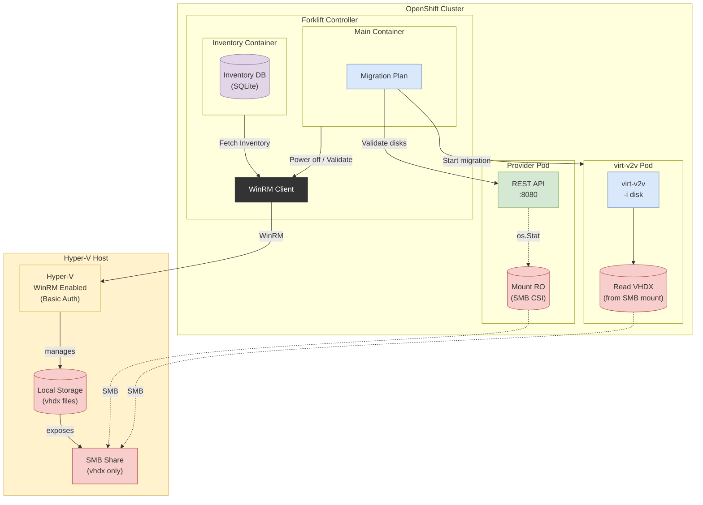

# Hyper-V Provider Architecture — Live Provider via WinRM

**Status**: Current (post-refactor)
**Updated**: February 2026

---

## Overview

The Hyper-V provider uses a **controller-driven WinRM** model. Inventory collection,
VM power management, and disk validation all originate from the Forklift controller.
The provider-server pod is reduced to an SMB mount holder with a lightweight HTTP API.

---

## Architecture Diagram



---

## Flow

### 1. Provider Setup

The controller reconciles the `Provider` CR and deploys:

| Resource | Purpose |
|----------|---------|
| PersistentVolume | Static PV backed by SMB CSI driver (`smb.csi.k8s.io`), source from `secret.smbUrl` |
| PersistentVolumeClaim | Bound to the PV |
| Deployment | Provider-server pod — mounts SMB at `/hyperv`, runs HTTP on :8080 |
| Service | ClusterIP exposing port 8080 |

### 2. Inventory Collection (Controller → Hyper-V via WinRM)

The controller's inventory collector connects **directly** to the Hyper-V host
over WinRM/HTTPS (port 5986). It runs a polling loop (default 10s) that:

| Step | PowerShell Command | Data Collected |
|------|--------------------|----------------|
| a | `Get-VM` | All VMs: name, state, ID |
| b | `Get-VM` + `Get-VMProcessor` + `Get-VMNetworkAdapter` | VM metadata: CPU, memory, NICs, MAC addresses |
| c | `Get-SmbShare` | SMB windows prefix for disk path mapping |
| d | `Get-VHD -Path` | Disk virtual size |
| e | `Get-VM` | VM power state |
| f | KVP exchange (WMI) | Guest network configuration |

After collecting VM info, the controller calls the provider-server's
`POST /validate-disks` endpoint to verify that VHDX paths are accessible
on the SMB mount.

Inventory updates are pushed into the controller's in-memory SQLite DB.

### 3. Disk Path Mapping

The collector discovers the Windows-side SMB share path via
`(Get-SmbShare -Name '<share>').Path` (e.g. `E:\VMs`) and maps
Windows disk paths to SMB mount paths:

```
Windows:  E:\VMs\myvm\disk.vhdx
SMB:      /hyperv/myvm/disk.vhdx
```

### 4. Cold Migration

When migration starts:

| Step | Actor | Action |
|------|-------|--------|
| a | Controller | Powers off the VM via WinRM (`Stop-VM`) and validates it is off |
| b | Controller | Creates virt-v2v pod with its own SMB PV/PVC |
| c | virt-v2v pod | Mounts the SMB share at `/hyperv` (same share, separate PV/PVC) |
| d | virt-v2v pod | Reads VHDX files directly: `virt-v2v -i disk /hyperv/…/disk.vhdx -o local -os /var/tmp/v2v` |
| e | Controller | Creates the KubeVirt VM from converted disks |

### 5. Provider-Server Pod (Minimal)

The provider-server pod no longer performs inventory or WinRM operations.
It serves two purposes:

1. **Keeps the SMB CSI volume mounted** (by staying alive)
2. **Exposes utility endpoints:**
   - `GET /healthz` — liveness check
   - `POST /validate-disks` — accepts `{"paths": [...]}`, returns `{"missing": [...]}` for paths that don't exist on the SMB mount

---

## Connection Summary

| Connection | Initiator | Protocol | Port | Purpose |
|------------|-----------|----------|------|---------|
| Inventory collection | Controller | WinRM / HTTPS | 5986 | PowerShell commands to collect VM inventory |
| VM PowerOff | Controller | WinRM / HTTPS | 5986 | `Stop-VM` during migration |
| Disk validation | Controller | HTTP | 8080 | Validate VHDX paths on SMB mount |
| SMB (provider pod) | CSI driver | SMB3 | 445 | Mount share for disk validation |
| SMB (virt-v2v pod) | CSI driver | SMB3 | 445 | Mount share for disk reading during conversion |

---

## Key Difference from Previous Design

| Aspect | Before (provider-server model) | After (controller WinRM model) |
|--------|-------------------------------|-------------------------------|
| Inventory collection | Provider-server pod via WinRM polling loop | Controller connects to Hyper-V directly via WinRM |
| WinRM client | Inside provider-server pod | Inside forklift-controller |
| PowerOff | Provider-server REST API (`POST /vms/:name/poweroff`) | Controller via WinRM directly |
| Provider-server role | Full REST API (inventory + power ops + disk validation) | SMB mount holder + `/validate-disks` only |
| In-memory cache | Inside provider-server | Inside controller (SQLite) |
