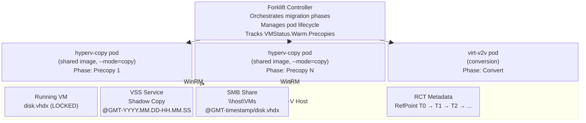

# Hyper-V Warm Migration Design Document

**Status**: Draft  
**Authors**: Forklift Team  
**Created**: January 2026  
**Last Updated**: April 2026

## Table of Contents

1. [Executive Summary](#executive-summary)
2. [Current State: Cold Migration Transfer Modes](#current-state-cold-migration-transfer-modes)
3. [Background](#background)
4. [Goals and Non-Goals](#goals-and-non-goals)
5. [Architecture Overview](#architecture-overview)
6. [Components](#components)
7. [Detailed Design](#detailed-design)
8. [WinRM Commands Reference](#winrm-commands-reference)
9. [RCT (Resilient Change Tracking)](#rct-resilient-change-tracking)
10. [VSS (Volume Shadow Copy Service)](#vss-volume-shadow-copy-service)
11. [VHDX Handling](#vhdx-handling)
12. [Migration Phases](#migration-phases)
13. [Data Structures](#data-structures)
14. [Error Handling](#error-handling)
15. [Security Considerations](#security-considerations)
16. [Testing Strategy](#testing-strategy)
17. [Implementation Checklist](#implementation-checklist)
18. [Future Considerations](#future-considerations)
19. [Design Decision: Hybrid Image Approach](#design-decision-hybrid-image-approach)

---

## Executive Summary

This document describes the design for supporting warm migration from Hyper-V to OpenShift Virtualization using Forklift. Warm migration allows migrating VMs with minimal downtime by performing incremental data transfers while the VM remains running, followed by a brief cutover period.

> **Current status (April 2026):** Hyper-V supports **cold migration only** with two transfer modes — **SMB** (default, uses virt-v2v) and **iSCSI** (uses HyperVVolumePopulator). Warm migration is **not yet implemented**; `Validator.WarmMigration()` returns `false`. See [Current State](#current-state-cold-migration-transfer-modes) for details on what ships today. The rest of this document is the **design spec for warm migration** (SMB-based).

The solution uses ephemeral **hyperv-copy pods** that reuse the `hyperv-provider-server` container image running in `--mode=copy`. This hybrid approach avoids maintaining a separate image while keeping the disk-copy pods distinct from the long-running inventory server. Each copy pod handles:
- VSS (Volume Shadow Copy Service) for creating point-in-time snapshots of running VMs
- RCT (Resilient Change Tracking) for identifying changed blocks between snapshots
- SMB for network access to VHDX files
- qemu-nbd for VHDX format translation (logical to physical offsets)

Pod naming convention:
- Inventory server: `hyperv-<provider>-<hash>` (long-running)
- Disk copy: `hyperv-copy-<vm>-<hash>` (ephemeral, per-VM per-precopy)

---

## Current State: Cold Migration Transfer Modes

As of v2.12, Hyper-V supports **cold migration only** with two transfer modes: **SMB** (default) and **iSCSI**. The transfer mode is selected via the provider settings map:

```go
// pkg/apis/forklift/v1beta1/provider.go
const (
    HyperVTransferMethod      = "hyperVTransferMethod"
    HyperVTransferMethodSMB   = "smb"   // default
    HyperVTransferMethodISCSI = "iscsi"
)

func (p *Provider) GetHyperVTransferMethod() string {
    if m, ok := p.Spec.Settings[HyperVTransferMethod]; ok && m == HyperVTransferMethodISCSI {
        return HyperVTransferMethodISCSI
    }
    return HyperVTransferMethodSMB
}
```

### SMB Transfer Mode (Default)

**How it works:** A `HyperVProviderServer` deployment mounts the SMB share via the SMB CSI driver (`smb.csi.k8s.io`) and runs the inventory server. At migration time, `virt-v2v` reads VHDX files from the mounted share.

**Key components:**
- `HyperVProviderServer` CR + deployment with SMB CSI PV/PVC (see `pkg/controller/hyperv/builder.go`)
- Provider validation: checks `CSIDriver` `smb.csi.k8s.io` exists, validates `smbUrl` format, waits for provider-server pod readiness, detects stuck SMB mounts
- Migration uses `virt-v2v` with `-i disk` mode reading from the SMB mount

```go
// pkg/controller/plan/adapter/hyperv/builder.go — SMB uses virt-v2v for transfer
// pkg/apis/forklift/v1beta1/plan.go
case HyperV:
    return source.GetHyperVTransferMethod() == HyperVTransferMethodSMB, nil
```

**Provider validation flow (SMB):**

```go
// pkg/controller/provider/validation.go
// 1. Secret must contain: username, password, smbUrl
// 2. smbUrl format validated (//server/share, \\server\share, smb://server/share)
// 3. CSIDriver "smb.csi.k8s.io" must exist (sets SMBCSIDriverNotReady if missing)
// 4. HyperVProviderServer pod must be ready (sets WaitingForService / SMBMountFailed)
// 5. WinRM connection test to Hyper-V host
```

**SMB CSI driver prerequisite:** The operator **does not** auto-create the `ClusterCSIDriver` CR. Users must:
1. Install the CIFS/SMB CSI Driver Operator
2. Create the `ClusterCSIDriver` CR manually:
```yaml
apiVersion: operator.openshift.io/v1
kind: ClusterCSIDriver
metadata:
  name: smb.csi.k8s.io
spec:
  managementState: Managed
```

### iSCSI Transfer Mode

**How it works:** The Hyper-V host acts as an iSCSI Target Server. During migration, the controller creates iSCSI targets with VHDX-backed LUNs on the host, and `HyperVVolumePopulator` pods on the OpenShift side connect as initiators to copy the data.

**Key components:**
- Provider validation: checks iSCSI Target Server feature installed + firewall port 3260 open (Warn, not Critical)
- `PreTransferActions`: creates iSCSI targets and differencing-disk LUNs via WinRM
- `HyperVVolumePopulator` CRs + privileged/hostNetwork populator pods with `iscsiadm`
- `Finalize`: tears down iSCSI targets via WinRM

```go
// pkg/controller/plan/adapter/hyperv/builder.go — iSCSI uses volume populator, not virt-v2v
func (r *Builder) SupportsVolumePopulators() bool {
    return r.Source.Provider.GetHyperVTransferMethod() == api.HyperVTransferMethodISCSI
}
```

**Provider validation flow (iSCSI):**

```go
// pkg/controller/provider/validation.go
// 1. Secret must contain: username, password (no smbUrl needed)
// 2. WinRM connection test to Hyper-V host
// 3. CheckIscsiReadiness via WinRM:
//    a. iSCSI Target Server feature installed? (Warn if not)
//    b. Firewall port TCP 3260 open? (Warn if not)
```

### Comparison

| Aspect | SMB | iSCSI |
|--------|-----|-------|
| **Transfer tool** | virt-v2v (reads from mounted share) | Volume populator (iscsiadm + dd) |
| **Prerequisites** | SMB CSI driver + share access | iSCSI Target Server feature + port 3260 |
| **Provider server** | `HyperVProviderServer` deployment with SMB mount | Not needed |
| **Privilege** | Provider-server pod (unprivileged) | Populator pods (privileged, hostNetwork) |
| **Warm support** | Planned (this document) | Not planned |
| **Guest conversion** | virt-v2v handles disk copy + conversion | Separate virt-v2v conversion pod after copy |

---

## Background

### Current Hyper-V Cold Migration Flow

```
┌─────────────────────────────────────────────────────────────────────────────┐
│                    CURRENT COLD MIGRATION                                    │
└─────────────────────────────────────────────────────────────────────────────┘

1. Power off source VM
2. Mount SMB share in virt-v2v pod
3. virt-v2v reads VHDX via -i disk mode
4. Full disk copy + guest conversion
5. Create KubeVirt VM
6. Start VM on OpenShift

Downtime: ENTIRE migration duration (hours for large disks)
```

### Warm Migration Goal

```
┌─────────────────────────────────────────────────────────────────────────────┐
│                    WARM MIGRATION                                            │
└─────────────────────────────────────────────────────────────────────────────┘

1. VM stays running
2. Initial bulk copy (via VSS snapshot)
3. Incremental copies (RCT-guided)
4. Final cutover: power off → last sync → power on target

Downtime: Only final sync duration (minutes)
```

### Key Challenges

| Challenge | Solution |
|-----------|----------|
| Live VHDX is locked by vmwp.exe | Use VSS to create shadow copy |
| Need to track changes | Use RCT (Resilient Change Tracking) |
| RCT returns logical offsets | Use qemu-nbd to translate via VHDX BAT |
| No native CDI data source | Ephemeral copy pod (reuses `hyperv-provider-server` image with `--mode=copy`) |
| SMB CSI driver must exist | Validate `CSIDriver` `smb.csi.k8s.io` at provider creation; guide user on `ClusterCSIDriver` CR |
| iSCSI alternative path (cold only) | `HyperVVolumePopulator` + iSCSI Target Server on host (not applicable to warm) |

---

## Goals and Non-Goals

### Goals

1. **Minimize downtime** - VM should remain running during bulk data transfer
2. **Efficient incremental sync** - Only transfer changed blocks using RCT
3. **Reliable cutover** - Ensure data consistency during final sync
4. **Reuse existing infrastructure** - Leverage existing SMB mounts, WinRM connections
5. **Observable** - Provide progress reporting compatible with existing UI

### Non-Goals

1. **Live migration** - Zero-downtime migration (future consideration)
2. **Upstream CDI integration** - Initial implementation is Forklift-specific
3. **Shared disk support** - Warm migration will not support shared disks initially
4. **CBT-less migration** - RCT is required; no fallback to full sync per phase
5. **iSCSI warm migration** - Warm migration is **SMB-only**; iSCSI remains cold-only

> **Implementation note:** `Validator.WarmMigration()` currently returns `false` for Hyper-V (`pkg/controller/plan/adapter/hyperv/validator.go`). This must return `true` (for SMB mode) before warm migration is enabled:
> ```go
> // Target state — enable warm only for SMB
> func (r *Validator) WarmMigration() bool {
>     return r.plan.Source.Provider.GetHyperVTransferMethod() == api.HyperVTransferMethodSMB
> }
> ```

---

## Architecture Overview



> **Note:** `@GMT-YYYY.MM.DD-HH.MM.SS` is the VSS shadow copy timestamp convention.
> SMB exposes point-in-time snapshots at this path, allowing the hyperv-copy pod
> to read a consistent disk image while the VM is running and the live disk is locked.

---

## Components

### 1. hyperv-copy Pod (hybrid: shared `hyperv-provider-server` image)

The hyperv-copy pod is **not** a separate container image. It is the same `hyperv-provider-server` image launched with `--mode=copy`, which activates the disk-copy entrypoint instead of the default inventory-server entrypoint. Each copy pod is ephemeral (one per VM per precopy phase) and is responsible for:
- Executing WinRM commands on Hyper-V host
- Creating/managing VSS snapshots
- Querying RCT for changed blocks
- Reading VHDX data via SMB + qemu-nbd
- Writing data to target PVC

```
┌─────────────────────────────────────────────────────────────────────────────┐
│                         hyperv-copy Pod                                      │
└─────────────────────────────────────────────────────────────────────────────┘

┌─────────────────────────────────────────────────────────────────────────────┐
│                                                                              │
│  ┌────────────────┐  ┌────────────────┐  ┌────────────────┐                 │
│  │  WinRM Client  │  │  SMB Mount     │  │  qemu-nbd      │                 │
│  │                │  │                │  │                │                 │
│  │  - VSS cmds    │  │  /mnt/smb      │  │  /dev/nbd0     │                 │
│  │  - RCT queries │  │  (cifs mount)  │  │  (VHDX→block)  │                 │
│  │  - Power ops   │  │                │  │                │                 │
│  └───────┬────────┘  └───────┬────────┘  └───────┬────────┘                 │
│          │                   │                   │                          │
│          └───────────────────┼───────────────────┘                          │
│                              │                                              │
│                              ▼                                              │
│                    ┌────────────────────┐                                   │
│                    │   Copy Engine      │                                   │
│                    │                    │                                   │
│                    │  - Full copy       │                                   │
│                    │  - Incremental     │                                   │
│                    │  - Progress report │                                   │
│                    └─────────┬──────────┘                                   │
│                              │                                              │
│                              ▼                                              │
│                    ┌────────────────────┐                                   │
│                    │   Target PVC       │                                   │
│                    │   /dev/target      │                                   │
│                    └────────────────────┘                                   │
│                                                                              │
└─────────────────────────────────────────────────────────────────────────────┘
```

### 2. Container Image Contents

The `hyperv-provider-server` Containerfile is extended with the packages needed for
disk copy (`qemu-img`, `qemu-nbd`, `cifs-utils`, `nbd`). The single binary supports
both modes: the default inventory server and `--mode=copy` for disk transfer.

> **Current state:** The Containerfile already installs `qemu-img` and `cifs-utils` for cold SMB migration. Warm migration additionally requires `qemu-nbd` and `nbd` (kernel module) for VHDX logical-to-physical offset translation.

```dockerfile
# build/hyperv-provider-server/Containerfile

FROM registry.access.redhat.com/ubi9/go-toolset:1.24.4-1753221510 AS builder
USER 0
WORKDIR /app
COPY --chown=1001:0 ./ ./
ENV GOFLAGS="-mod=vendor -tags=strictfipsruntime"
ENV GOEXPERIMENT=strictfipsruntime
ENV GOCACHE=/go-build/cache
RUN --mount=type=cache,target=${GOCACHE},uid=1001 go build -ldflags="-w -s" -o hyperv-provider-server github.com/kubev2v/forklift/cmd/hyperv-provider-server

FROM registry.access.redhat.com/ubi9-minimal:9.6-1752587672
RUN microdnf -y install tar qemu-img qemu-nbd cifs-utils nbd && microdnf clean all

COPY --from=builder /app/hyperv-provider-server /usr/local/bin/hyperv-provider-server
USER 1001

# Default entrypoint starts the inventory server.
# Pass --mode=copy to run as an ephemeral disk-copy pod instead.
ENTRYPOINT ["/usr/local/bin/hyperv-provider-server"]
```

### 3. Required Kubernetes Resources

> **RBAC note:** The existing `forklift-controller` ClusterRole already grants `get/list/watch` on `csidrivers` (`storage.k8s.io`). Warm migration does **not** require additional RBAC for CSI — the SMB CSI PV/PVC and provider-server infra already exist from cold migration setup. The copy pod needs only pod CRUD and PVC read access:
> ```yaml
> # operator/config/rbac/forklift-controller_role.yaml (existing)
> - apiGroups: ["storage.k8s.io"]
>   resources: ["storageclasses", "csidrivers"]
>   verbs: ["get", "list", "watch"]
> ```

```yaml
# Pod spec for hyperv-copy (uses the shared hyperv-provider-server image)
apiVersion: v1
kind: Pod
metadata:
  name: hyperv-copy-${vm-id}-${phase}
  labels:
    app: forklift
    plan: ${plan-uid}
    migration: ${migration-uid}
    vmID: ${vm-id}
    role: hyperv-copy
spec:
  containers:
  - name: hyperv-copy
    image: quay.io/kubev2v/hyperv-provider-server:latest
    args: ["--mode=copy"]
    securityContext:
      privileged: true  # Required for nbd device
    env:
    - name: WINRM_HOST
      valueFrom:
        secretKeyRef:
          name: ${provider-secret}
          key: host
    - name: WINRM_USER
      valueFrom:
        secretKeyRef:
          name: ${provider-secret}
          key: user
    - name: WINRM_PASSWORD
      valueFrom:
        secretKeyRef:
          name: ${provider-secret}
          key: password
    - name: SMB_PATH
      value: "//host/VMs/vm-name"
    - name: VHDX_FILE
      value: "disk.vhdx"
    - name: COPY_MODE
      value: "incremental"  # or "full"
    - name: PREVIOUS_VSS
      value: "@GMT-2024.01.15-10.00.00"
    - name: CURRENT_VSS
      value: "@GMT-2024.01.15-12.00.00"
    - name: PREVIOUS_RCT_REF
      value: "abc123-def456"
    - name: CURRENT_RCT_REF
      value: "ghi789-jkl012"
    volumeMounts:
    - name: smb-credentials
      mountPath: /etc/smb-credentials
      readOnly: true
    - name: target-pvc
      mountPath: /dev/target
    volumeDevices:
    - name: target-pvc
      devicePath: /dev/target
  volumes:
  - name: smb-credentials
    secret:
      secretName: ${provider-secret}
  - name: target-pvc
    persistentVolumeClaim:
      claimName: ${target-pvc-name}
```

---

## Detailed Design

### High-Level Flow

```
┌─────────────────────────────────────────────────────────────────────────────┐
│                    WARM MIGRATION STATE MACHINE                              │
└─────────────────────────────────────────────────────────────────────────────┘

                              ┌─────────────────┐
                              │     Started     │
                              └────────┬────────┘
                                       │
                              ┌────────▼────────┐
                              │   EnableRCT     │
                              └────────┬────────┘
                                       │
                              ┌────────▼────────┐
                              │ CreateInitialVSS│
                              └────────┬────────┘
                                       │
                              ┌────────▼────────┐
                              │ WaitForVSS      │
                              └────────┬────────┘
                                       │
                              ┌────────▼────────┐
                              │CreateDataVolumes│
                              └────────┬────────┘
                                       │
         ┌─────────────────────────────┼─────────────────────────────┐
         │                    PRECOPY LOOP                            │
         │                                                            │
         │  ┌────────────────────────────────────────────────────┐   │
         │  │                                                    │   │
         │  │  ┌────────────────┐                                │   │
         │  │  │ CopyDisks      │◄─────────────────────────────┐ │   │
         │  │  │ (hyperv-copy)  │                              │ │   │
         │  │  └───────┬────────┘                              │ │   │
         │  │          │                                       │ │   │
         │  │  ┌───────▼────────┐                              │ │   │
         │  │  │ CopyingPaused  │ (wait for next precopy time) │ │   │
         │  │  └───────┬────────┘                              │ │   │
         │  │          │                                       │ │   │
         │  │  ┌───────▼────────┐                              │ │   │
         │  │  │RemovePrevVSS   │                              │ │   │
         │  │  └───────┬────────┘                              │ │   │
         │  │          │                                       │ │   │
         │  │  ┌───────▼────────┐                              │ │   │
         │  │  │ CreateVSS      │                              │ │   │
         │  │  └───────┬────────┘                              │ │   │
         │  │          │                                       │ │   │
         │  │  ┌───────▼────────┐                              │ │   │
         │  │  │ QueryRCT       │                              │ │   │
         │  │  └───────┬────────┘                              │ │   │
         │  │          │                                       │ │   │
         │  │          └───────────────────────────────────────┘ │   │
         │  │                                                    │   │
         │  └────────────────────────────────────────────────────┘   │
         │                                                            │
         └───────────────────────────┬────────────────────────────────┘
                                     │
                                     │ Cutover triggered
                                     │
                              ┌──────▼───────┐
                              │StorePowerState│
                              └──────┬───────┘
                                     │
                              ┌──────▼───────┐
                              │PowerOffSource │
                              └──────┬───────┘
                                     │
                              ┌──────▼───────┐
                              │WaitPowerOff  │
                              └──────┬───────┘
                                     │
                              ┌──────▼───────┐
                              │CreateFinalVSS│
                              └──────┬───────┘
                                     │
                              ┌──────▼───────┐
                              │ FinalCopy    │
                              │(hyperv-copy) │
                              └──────┬───────┘
                                     │
                              ┌──────▼───────┐
                              │ Finalize     │
                              └──────┬───────┘
                                     │
                              ┌──────▼───────┐
                              │CleanupVSS    │
                              └──────┬───────┘
                                     │
                              ┌──────▼───────┐
                              │CreateConvPod │
                              │ (virt-v2v)   │
                              └──────┬───────┘
                                     │
                              ┌──────▼───────┐
                              │ConvertGuest  │
                              └──────┬───────┘
                                     │
                              ┌──────▼───────┐
                              │  CreateVM    │
                              └──────┬───────┘
                                     │
                              ┌──────▼───────┐
                              │  Completed   │
                              └──────────────┘
```

---

## WinRM Commands Reference

### Connection Setup

```go
// pkg/controller/plan/adapter/hyperv/winrm.go

package hyperv

import (
    "github.com/masterzen/winrm"
)

type WinRMClient struct {
    client   *winrm.Client
    host     string
    username string
    password string
}

func NewWinRMClient(host, username, password string) (*WinRMClient, error) {
    endpoint := winrm.NewEndpoint(
        host,
        5986,  // HTTPS port
        true,  // Use HTTPS
        true,  // Skip TLS verify (or use proper certs)
        nil,   // CA cert
        nil,   // Client cert
        nil,   // Client key
        0,     // Timeout
    )
    
    client, err := winrm.NewClient(endpoint, username, password)
    if err != nil {
        return nil, err
    }
    
    return &WinRMClient{
        client:   client,
        host:     host,
        username: username,
        password: password,
    }, nil
}

// ExecutePowerShell runs an encoded PowerShell command
func (c *WinRMClient) ExecutePowerShell(script string) (string, error) {
    // Encode script as UTF-16LE Base64 for -EncodedCommand
    encoded := utf16LEBase64Encode(script)
    
    stdout, stderr, exitCode, err := c.client.RunWithString(
        fmt.Sprintf("powershell.exe -EncodedCommand %s", encoded),
        "",
    )
    
    if err != nil {
        return "", err
    }
    if exitCode != 0 {
        return "", fmt.Errorf("PowerShell error (exit %d): %s", exitCode, stderr)
    }
    
    return stdout, nil
}
```

### RCT Commands

```powershell
# Enable RCT on a VHDX (must be done before first migration)
# PowerShell script: enable_rct.ps1

param(
    [string]$VMName,
    [string]$VHDPath
)

# Get the VM
$vm = Get-VM -Name $VMName -ErrorAction Stop

# Get the hard drive
$drive = Get-VMHardDiskDrive -VM $vm | Where-Object { $_.Path -eq $VHDPath }

if (-not $drive) {
    throw "Disk $VHDPath not found on VM $VMName"
}

# Enable RCT
Set-VMHardDiskDrive -VMHardDiskDrive $drive -SupportPersistentReservations $true

# Verify RCT is enabled
$settings = Get-VHD -Path $VHDPath
if ($settings.ResilientChangeTrackingEnabled) {
    Write-Output "RCT enabled successfully"
    Write-Output $settings | ConvertTo-Json
} else {
    throw "Failed to enable RCT"
}
```

```powershell
# Create RCT Reference Point
# PowerShell script: create_rct_refpoint.ps1

param(
    [string]$VMName
)

$vm = Get-VM -Name $VMName -ErrorAction Stop

# Create a reference point (not a full checkpoint)
$refPoint = Checkpoint-VM -VM $vm -SnapshotType Reference -Passthru

Write-Output @{
    Id = $refPoint.Id
    Name = $refPoint.Name
    CreationTime = $refPoint.CreationTime
    VMId = $refPoint.VMId
} | ConvertTo-Json
```

```powershell
# Query RCT Changed Blocks
# PowerShell script: query_rct_changes.ps1

param(
    [string]$VHDPath,
    [string]$FromRefPointId,
    [string]$ToRefPointId
)

$ims = Get-WmiObject -Namespace "root\virtualization\v2" -Class Msvm_ImageManagementService

# Query changes between reference points
$result = $ims.GetVirtualHardDiskChanges(
    $VHDPath,
    $FromRefPointId,
    $ToRefPointId,
    0,                    # ByteOffset (start)
    [uint64]::MaxValue    # ByteLength (entire disk)
)

if ($result.ReturnValue -ne 0) {
    throw "GetVirtualHardDiskChanges failed with code: $($result.ReturnValue)"
}

# Parse the changed byte ranges from XML
$changesXml = [xml]$result.ChangedByteRanges

$changes = @()
foreach ($range in $changesXml.SelectNodes("//PROPERTY[@NAME='ByteRanges']/VALUE/VALUE")) {
    $parts = $range.InnerText -split ":"
    $changes += @{
        Offset = [uint64]$parts[0]
        Length = [uint64]$parts[1]
    }
}

# Return as JSON array
$changes | ConvertTo-Json -Compress
```

```powershell
# Get RCT Reference Points for VM
# PowerShell script: list_rct_refpoints.ps1

param(
    [string]$VMName
)

$vm = Get-VM -Name $VMName -ErrorAction Stop

# Get reference points (not full snapshots)
$refPoints = Get-VMSnapshot -VM $vm -SnapshotType Reference

$refPoints | ForEach-Object {
    @{
        Id = $_.Id
        Name = $_.Name
        CreationTime = $_.CreationTime
    }
} | ConvertTo-Json
```

```powershell
# Remove RCT Reference Point
# PowerShell script: remove_rct_refpoint.ps1

param(
    [string]$VMName,
    [string]$RefPointId
)

$vm = Get-VM -Name $VMName -ErrorAction Stop
$refPoint = Get-VMSnapshot -VM $vm -Id $RefPointId -ErrorAction Stop

Remove-VMSnapshot -VMSnapshot $refPoint -Confirm:$false

Write-Output "Reference point $RefPointId removed successfully"
```

### VSS Commands

```powershell
# Create VSS Shadow Copy
# PowerShell script: create_vss_snapshot.ps1

param(
    [string]$Volume  # e.g., "C:\"
)

# Create shadow copy
$shadow = (Get-WmiObject -List Win32_ShadowCopy).Create($Volume, "ClientAccessible")

if ($shadow.ReturnValue -ne 0) {
    throw "Failed to create shadow copy: $($shadow.ReturnValue)"
}

$shadowId = $shadow.ShadowID

# Get the shadow copy details
$shadowCopy = Get-WmiObject Win32_ShadowCopy | Where-Object { $_.ID -eq $shadowId }

# Convert to SMB-accessible GMT format
$installDate = $shadowCopy.InstallDate
# Format: @GMT-YYYY.MM.DD-HH.MM.SS
$gmtPath = "@GMT-" + $installDate.Substring(0,4) + "." + 
           $installDate.Substring(4,2) + "." + 
           $installDate.Substring(6,2) + "-" +
           $installDate.Substring(8,2) + "." + 
           $installDate.Substring(10,2) + "." + 
           $installDate.Substring(12,2)

Write-Output @{
    ShadowId = $shadowId
    DevicePath = $shadowCopy.DeviceObject
    GMTPath = $gmtPath
    Volume = $Volume
    InstallDate = $installDate
} | ConvertTo-Json
```

```powershell
# List VSS Shadow Copies
# PowerShell script: list_vss_snapshots.ps1

param(
    [string]$Volume  # Optional filter
)

$shadows = Get-WmiObject Win32_ShadowCopy

if ($Volume) {
    $shadows = $shadows | Where-Object { $_.VolumeName -like "*$Volume*" }
}

$shadows | ForEach-Object {
    $installDate = $_.InstallDate
    $gmtPath = "@GMT-" + $installDate.Substring(0,4) + "." + 
               $installDate.Substring(4,2) + "." + 
               $installDate.Substring(6,2) + "-" +
               $installDate.Substring(8,2) + "." + 
               $installDate.Substring(10,2) + "." + 
               $installDate.Substring(12,2)
    
    @{
        ShadowId = $_.ID
        DevicePath = $_.DeviceObject
        GMTPath = $gmtPath
        Volume = $_.VolumeName
        InstallDate = $installDate
    }
} | ConvertTo-Json
```

```powershell
# Delete VSS Shadow Copy
# PowerShell script: delete_vss_snapshot.ps1

param(
    [string]$ShadowId
)

$shadow = Get-WmiObject Win32_ShadowCopy | Where-Object { $_.ID -eq $ShadowId }

if (-not $shadow) {
    throw "Shadow copy $ShadowId not found"
}

$shadow.Delete()
Write-Output "Shadow copy $ShadowId deleted successfully"
```

### Power Management Commands

```powershell
# Get VM Power State
# PowerShell script: get_power_state.ps1

param(
    [string]$VMName
)

$vm = Get-VM -Name $VMName -ErrorAction Stop

Write-Output @{
    VMName = $vm.Name
    State = $vm.State.ToString()
    Status = $vm.Status
    Uptime = $vm.Uptime.ToString()
} | ConvertTo-Json
```

```powershell
# Power Off VM (graceful)
# PowerShell script: stop_vm.ps1

param(
    [string]$VMName,
    [switch]$Force
)

$vm = Get-VM -Name $VMName -ErrorAction Stop

if ($vm.State -eq 'Running') {
    if ($Force) {
        Stop-VM -VM $vm -Force -TurnOff
    } else {
        # Graceful shutdown (requires integration services)
        Stop-VM -VM $vm -Force
    }
}

# Wait for power off
$timeout = 300  # 5 minutes
$elapsed = 0
while ((Get-VM -Name $VMName).State -ne 'Off' -and $elapsed -lt $timeout) {
    Start-Sleep -Seconds 5
    $elapsed += 5
}

$finalState = (Get-VM -Name $VMName).State
Write-Output @{
    VMName = $VMName
    State = $finalState.ToString()
    Success = ($finalState -eq 'Off')
} | ConvertTo-Json
```

---

## RCT (Resilient Change Tracking)

### Overview

RCT is a Hyper-V feature introduced in Windows Server 2016 that tracks block-level changes to VHDX files. It's conceptually similar to VMware's CBT (Changed Block Tracking).

### Key Concepts

```
┌─────────────────────────────────────────────────────────────────────────────┐
│                         RCT CONCEPTS                                         │
└─────────────────────────────────────────────────────────────────────────────┘

1. Reference Point: A point-in-time marker in the RCT log
   - NOT a full VM checkpoint/snapshot
   - Lightweight - just marks a position in change tracking
   - Created via Checkpoint-VM -SnapshotType Reference

2. Changed Blocks: Byte ranges modified between two reference points
   - Returned as (offset, length) pairs
   - Offset is LOGICAL (guest view of disk)
   - Granularity: 256KB blocks

3. RCT ID: Unique identifier for each reference point
   - GUID format
   - Used to query changes: GetVirtualHardDiskChanges(from, to)
```

### RCT Data Format

```
┌─────────────────────────────────────────────────────────────────────────────┐
│                    RCT QUERY RESULT FORMAT                                   │
└─────────────────────────────────────────────────────────────────────────────┘

WMI Method: Msvm_ImageManagementService.GetVirtualHardDiskChanges()

Input:
  - Path: "C:\VMs\disk.vhdx"
  - LimitId: "guid-of-older-refpoint"
  - SnapshotId: "guid-of-newer-refpoint"
  - ByteOffset: 0
  - ByteLength: uint64.Max

Output (XML):
<INSTANCE CLASSNAME="Msvm_VirtualHardDiskChanges">
  <PROPERTY NAME="ByteRanges" TYPE="string">
    <VALUE.ARRAY>
      <VALUE>0:262144</VALUE>           <!-- offset:length -->
      <VALUE>268435456:524288</VALUE>
      <VALUE>1073741824:262144</VALUE>
    </VALUE.ARRAY>
  </PROPERTY>
</INSTANCE>

Parsed Go struct:
type BlockChange struct {
    Offset uint64 `json:"offset"`  // Logical byte offset
    Length uint64 `json:"length"`  // Number of bytes changed
}

Example:
[
    {"offset": 0, "length": 262144},           // 256KB at start
    {"offset": 268435456, "length": 524288},   // 512KB at 256MB
    {"offset": 1073741824, "length": 262144}   // 256KB at 1GB
]
```

### Go Implementation for RCT

```go
// pkg/hyperv/copy/rct/rct.go

package rct

import (
    "encoding/json"
    "fmt"
)

// BlockChange represents a changed region from RCT
type BlockChange struct {
    Offset uint64 `json:"offset"`
    Length uint64 `json:"length"`
}

// RCTClient handles RCT operations via WinRM
type RCTClient struct {
    winrm *WinRMClient
}

// EnableRCT enables change tracking on a VHDX
func (r *RCTClient) EnableRCT(vmName, vhdPath string) error {
    script := fmt.Sprintf(`
        $vm = Get-VM -Name '%s'
        $drive = Get-VMHardDiskDrive -VM $vm | Where-Object { $_.Path -eq '%s' }
        Set-VMHardDiskDrive -VMHardDiskDrive $drive -SupportPersistentReservations $true
        
        $settings = Get-VHD -Path '%s'
        if (-not $settings.ResilientChangeTrackingEnabled) {
            throw "Failed to enable RCT"
        }
        Write-Output "OK"
    `, vmName, vhdPath, vhdPath)
    
    _, err := r.winrm.ExecutePowerShell(script)
    return err
}

// CreateRefPoint creates an RCT reference point
func (r *RCTClient) CreateRefPoint(vmName string) (string, error) {
    script := fmt.Sprintf(`
        $vm = Get-VM -Name '%s'
        $refPoint = Checkpoint-VM -VM $vm -SnapshotType Reference -Passthru
        Write-Output $refPoint.Id
    `, vmName)
    
    output, err := r.winrm.ExecutePowerShell(script)
    if err != nil {
        return "", err
    }
    
    return strings.TrimSpace(output), nil
}

// QueryChanges returns changed blocks between two reference points
func (r *RCTClient) QueryChanges(vhdPath, fromRefPoint, toRefPoint string) ([]BlockChange, error) {
    script := fmt.Sprintf(`
        $ims = Get-WmiObject -Namespace "root\virtualization\v2" -Class Msvm_ImageManagementService
        
        $result = $ims.GetVirtualHardDiskChanges(
            '%s',
            '%s',
            '%s',
            0,
            [uint64]::MaxValue
        )
        
        if ($result.ReturnValue -ne 0) {
            throw "RCT query failed: $($result.ReturnValue)"
        }
        
        $changesXml = [xml]$result.ChangedByteRanges
        $changes = @()
        
        foreach ($range in $changesXml.SelectNodes("//VALUE")) {
            $parts = $range.InnerText -split ":"
            if ($parts.Count -eq 2) {
                $changes += @{
                    offset = [uint64]$parts[0]
                    length = [uint64]$parts[1]
                }
            }
        }
        
        $changes | ConvertTo-Json -Compress
    `, vhdPath, fromRefPoint, toRefPoint)
    
    output, err := r.winrm.ExecutePowerShell(script)
    if err != nil {
        return nil, err
    }
    
    var changes []BlockChange
    if err := json.Unmarshal([]byte(output), &changes); err != nil {
        return nil, fmt.Errorf("failed to parse RCT output: %w", err)
    }
    
    return changes, nil
}

// RemoveRefPoint removes an RCT reference point
func (r *RCTClient) RemoveRefPoint(vmName, refPointId string) error {
    script := fmt.Sprintf(`
        $vm = Get-VM -Name '%s'
        $refPoint = Get-VMSnapshot -VM $vm -Id '%s'
        Remove-VMSnapshot -VMSnapshot $refPoint -Confirm:$false
    `, vmName, refPointId)
    
    _, err := r.winrm.ExecutePowerShell(script)
    return err
}
```

### RCT Limitations

| Limitation | Impact | Mitigation |
|------------|--------|------------|
| Max ~500 reference points per VHDX | Must clean up old ref points | Delete after each successful precopy |
| 256KB granularity | May copy slightly more than changed | Acceptable overhead |
| Must be enabled before first use | Requires VM config change | Check/enable during plan validation |
| Not available on Windows Server 2012 R2 | Older hosts not supported | Document as requirement |

---

## VSS (Volume Shadow Copy Service)

### Overview

VSS creates point-in-time read-only copies of volumes. For Hyper-V warm migration, VSS is essential because:

1. A running VM's VHDX file is locked by `vmwp.exe`
2. VSS creates a shadow copy that can be read while the VM runs
3. Shadow copies are accessible via SMB using `@GMT-*` path syntax

### VSS + SMB Integration

```
┌─────────────────────────────────────────────────────────────────────────────┐
│                    VSS SHADOW COPY ACCESS VIA SMB                            │
└─────────────────────────────────────────────────────────────────────────────┘

Normal path (LOCKED - VM is running):
  \\host\VMs\vm-name\disk.vhdx
  └── vmwp.exe has exclusive lock → Access Denied!

VSS shadow copy path (READABLE):
  \\host\VMs\@GMT-2024.01.15-10.30.00\vm-name\disk.vhdx
              └── Previous Version syntax
  └── Points to shadow copy → Readable!

How it works:
1. VSS creates shadow copy of C:\ volume
2. Shadow copy has device path: \\?\GLOBALROOT\Device\HarddiskVolumeShadowCopy3
3. SMB server exposes this as "Previous Version"
4. Access via: \\share\@GMT-YYYY.MM.DD-HH.MM.SS\path\to\file
```

### Go Implementation for VSS

```go
// pkg/hyperv/copy/vss/vss.go

package vss

import (
    "encoding/json"
    "fmt"
    "time"
)

// ShadowCopy represents a VSS snapshot
type ShadowCopy struct {
    ShadowId    string `json:"ShadowId"`
    DevicePath  string `json:"DevicePath"`
    GMTPath     string `json:"GMTPath"`
    Volume      string `json:"Volume"`
    InstallDate string `json:"InstallDate"`
}

// VSSClient handles VSS operations via WinRM
type VSSClient struct {
    winrm *WinRMClient
}

// CreateShadowCopy creates a new VSS snapshot
func (v *VSSClient) CreateShadowCopy(volume string) (*ShadowCopy, error) {
    script := fmt.Sprintf(`
        $shadow = (Get-WmiObject -List Win32_ShadowCopy).Create('%s', "ClientAccessible")
        
        if ($shadow.ReturnValue -ne 0) {
            throw "Failed to create shadow copy: $($shadow.ReturnValue)"
        }
        
        $shadowId = $shadow.ShadowID
        $shadowCopy = Get-WmiObject Win32_ShadowCopy | Where-Object { $_.ID -eq $shadowId }
        
        $installDate = $shadowCopy.InstallDate
        $gmtPath = "@GMT-" + $installDate.Substring(0,4) + "." + 
                   $installDate.Substring(4,2) + "." + 
                   $installDate.Substring(6,2) + "-" +
                   $installDate.Substring(8,2) + "." + 
                   $installDate.Substring(10,2) + "." + 
                   $installDate.Substring(12,2)
        
        @{
            ShadowId = $shadowId
            DevicePath = $shadowCopy.DeviceObject
            GMTPath = $gmtPath
            Volume = '%s'
            InstallDate = $installDate
        } | ConvertTo-Json
    `, volume, volume)
    
    output, err := v.winrm.ExecutePowerShell(script)
    if err != nil {
        return nil, err
    }
    
    var shadow ShadowCopy
    if err := json.Unmarshal([]byte(output), &shadow); err != nil {
        return nil, fmt.Errorf("failed to parse VSS output: %w", err)
    }
    
    return &shadow, nil
}

// DeleteShadowCopy removes a VSS snapshot
func (v *VSSClient) DeleteShadowCopy(shadowId string) error {
    script := fmt.Sprintf(`
        $shadow = Get-WmiObject Win32_ShadowCopy | Where-Object { $_.ID -eq '%s' }
        if ($shadow) {
            $shadow.Delete()
            Write-Output "Deleted"
        } else {
            throw "Shadow copy not found: %s"
        }
    `, shadowId, shadowId)
    
    _, err := v.winrm.ExecutePowerShell(script)
    return err
}

// BuildSMBPath constructs the full SMB path with VSS GMT component
func BuildSMBPath(smbShare, gmtPath, relativePath string) string {
    // smbShare: //host/share or \\host\share
    // gmtPath: @GMT-2024.01.15-10.30.00
    // relativePath: vm-name/disk.vhdx
    
    return fmt.Sprintf("%s/%s/%s", smbShare, gmtPath, relativePath)
}
```

### VSS Considerations

| Consideration | Details |
|---------------|---------|
| **Storage overhead** | Shadow copies consume space for changed blocks |
| **Retention** | Must delete shadow copies after migration |
| **Max shadows** | Default limit ~64 per volume; adjust if needed |
| **Performance** | Minimal impact on running VM |
| **Consistency** | Application-consistent if VSS writers cooperate |

---

## VHDX Handling

### The Logical vs Physical Problem

```
┌─────────────────────────────────────────────────────────────────────────────┐
│                    VHDX LOGICAL VS PHYSICAL ADDRESSING                       │
└─────────────────────────────────────────────────────────────────────────────┘

RCT returns LOGICAL offsets (what guest sees):
  ┌─────────────────────────────────────────────────────────────────────────┐
  │  LBA 0    LBA 1000   LBA 2000   LBA 3000   LBA 4000                    │
  │  [A]      [B]        [C]        [D]        [E]                         │
  │                                                                         │
  │  RCT says: "Offset 0x200000 (LBA 1000) changed"                        │
  └─────────────────────────────────────────────────────────────────────────┘

VHDX file has PHYSICAL layout (sparse, out-of-order):
  ┌─────────────────────────────────────────────────────────────────────────┐
  │  FileOffset: 0x0     0x100000   0x200000   0x300000                    │
  │  ┌────────┬────────┬──────────┬──────────┬─────────┐                   │
  │  │ Header │  BAT   │ Block D  │ Block A  │ Block C │                   │
  │  │        │        │(LBA 3000)│(LBA 0)   │(LBA 2000)│                  │
  │  └────────┴────────┴──────────┴──────────┴─────────┘                   │
  └─────────────────────────────────────────────────────────────────────────┘

PROBLEM: Cannot read raw VHDX file at RCT logical offset!
SOLUTION: Use qemu-nbd to expose VHDX as block device with logical addressing
```

### qemu-nbd Solution

```
┌─────────────────────────────────────────────────────────────────────────────┐
│                    QEMU-NBD VHDX TRANSLATION                                 │
└─────────────────────────────────────────────────────────────────────────────┘

1. Mount SMB share:
   mount -t cifs //host/VMs/@GMT-xxx /mnt/smb -o credentials=/etc/creds

2. Load NBD kernel module:
   modprobe nbd max_part=16

3. Connect qemu-nbd to VHDX:
   qemu-nbd -c /dev/nbd0 -f vhdx /mnt/smb/vm-name/disk.vhdx --read-only

4. Now /dev/nbd0 provides LOGICAL access:
   - Read at logical offset 0x200000 → qemu-nbd translates via VHDX BAT
   - Returns correct data regardless of physical layout

5. Read changed blocks using RCT offsets:
   for (offset, length) in rct_changes:
       dd if=/dev/nbd0 skip=offset bs=1 count=length | write to target

6. Disconnect when done:
   qemu-nbd -d /dev/nbd0
   umount /mnt/smb
```

### Go Implementation for VHDX Reading

```go
// pkg/hyperv/copy/vhdx/reader.go

package vhdx

import (
    "fmt"
    "os"
    "os/exec"
    "syscall"
)

// VHDXReader provides logical block access to a VHDX file via qemu-nbd
type VHDXReader struct {
    smbMountPoint string
    nbdDevice     string
    vhdxPath      string
    deviceFile    *os.File
    size          uint64
}

// NewVHDXReader sets up SMB mount and qemu-nbd connection
func NewVHDXReader(smbShare, gmtPath, vhdxRelPath, smbCredentials string) (*VHDXReader, error) {
    r := &VHDXReader{
        smbMountPoint: "/mnt/smb",
        nbdDevice:     "/dev/nbd0",
    }
    
    // 1. Create mount point
    if err := os.MkdirAll(r.smbMountPoint, 0755); err != nil {
        return nil, fmt.Errorf("failed to create mount point: %w", err)
    }
    
    // 2. Build full SMB path with VSS GMT component
    smbPath := fmt.Sprintf("%s/%s", smbShare, gmtPath)
    
    // 3. Mount SMB share
    cmd := exec.Command("mount", "-t", "cifs",
        smbPath,
        r.smbMountPoint,
        "-o", fmt.Sprintf("credentials=%s,ro", smbCredentials),
    )
    if err := cmd.Run(); err != nil {
        return nil, fmt.Errorf("failed to mount SMB: %w", err)
    }
    
    // 4. Build full VHDX path
    r.vhdxPath = fmt.Sprintf("%s/%s", r.smbMountPoint, vhdxRelPath)
    
    // 5. Load NBD module
    cmd = exec.Command("modprobe", "nbd", "max_part=16")
    if err := cmd.Run(); err != nil {
        r.Close()
        return nil, fmt.Errorf("failed to load nbd module: %w", err)
    }
    
    // 6. Connect qemu-nbd
    cmd = exec.Command("qemu-nbd",
        "-c", r.nbdDevice,
        "-f", "vhdx",
        r.vhdxPath,
        "--read-only",
    )
    if err := cmd.Run(); err != nil {
        r.Close()
        return nil, fmt.Errorf("failed to connect qemu-nbd: %w", err)
    }
    
    // 7. Open NBD device
    deviceFile, err := os.OpenFile(r.nbdDevice, os.O_RDONLY, 0)
    if err != nil {
        r.Close()
        return nil, fmt.Errorf("failed to open nbd device: %w", err)
    }
    r.deviceFile = deviceFile
    
    // 8. Get disk size
    size, err := r.getSize()
    if err != nil {
        r.Close()
        return nil, fmt.Errorf("failed to get disk size: %w", err)
    }
    r.size = size
    
    return r, nil
}

// getSize returns the logical size of the VHDX
func (r *VHDXReader) getSize() (uint64, error) {
    // Use ioctl to get block device size
    var size uint64
    _, _, errno := syscall.Syscall(
        syscall.SYS_IOCTL,
        r.deviceFile.Fd(),
        0x80081272, // BLKGETSIZE64
        uintptr(unsafe.Pointer(&size)),
    )
    if errno != 0 {
        return 0, fmt.Errorf("ioctl BLKGETSIZE64 failed: %v", errno)
    }
    return size, nil
}

// Size returns the logical disk size
func (r *VHDXReader) Size() uint64 {
    return r.size
}

// ReadAt reads len(p) bytes at logical offset off
func (r *VHDXReader) ReadAt(p []byte, off int64) (int, error) {
    return r.deviceFile.ReadAt(p, off)
}

// Close disconnects qemu-nbd and unmounts SMB
func (r *VHDXReader) Close() error {
    var errs []error
    
    if r.deviceFile != nil {
        if err := r.deviceFile.Close(); err != nil {
            errs = append(errs, err)
        }
    }
    
    // Disconnect qemu-nbd
    cmd := exec.Command("qemu-nbd", "-d", r.nbdDevice)
    if err := cmd.Run(); err != nil {
        errs = append(errs, err)
    }
    
    // Unmount SMB
    cmd = exec.Command("umount", r.smbMountPoint)
    if err := cmd.Run(); err != nil {
        errs = append(errs, err)
    }
    
    if len(errs) > 0 {
        return fmt.Errorf("cleanup errors: %v", errs)
    }
    return nil
}
```

---

## Migration Phases

### Phase Definitions

```go
// pkg/apis/forklift/v1beta1/plan/phases.go

const (
    // Warm migration phases for Hyper-V
    PhaseEnableRCT                    = "EnableRCT"
    PhaseCreateInitialVSS             = "CreateInitialVSS"
    PhaseWaitForInitialVSS            = "WaitForInitialVSS"
    PhaseStoreInitialRCTDeltas        = "StoreInitialRCTDeltas"
    
    // Precopy loop
    PhaseCopyDisksHyperV              = "CopyDisksHyperV"
    PhaseCopyingPaused                = "CopyingPaused"
    PhaseRemovePreviousVSS            = "RemovePreviousVSS"
    PhaseCreateVSS                    = "CreateVSS"
    PhaseWaitForVSS                   = "WaitForVSS"
    PhaseStoreRCTDeltas               = "StoreRCTDeltas"
    PhaseAddRCTCheckpoint             = "AddRCTCheckpoint"
    
    // Cutover
    PhaseStorePowerState              = "StorePowerState"
    PhasePowerOffSource               = "PowerOffSource"
    PhaseWaitForPowerOff              = "WaitForPowerOff"
    PhaseCreateFinalVSS               = "CreateFinalVSS"
    PhaseWaitForFinalVSS              = "WaitForFinalVSS"
    PhaseFinalCopy                    = "FinalCopy"
    PhaseFinalize                     = "Finalize"
    PhaseCleanupVSS                   = "CleanupVSS"
    PhaseCleanupRCT                   = "CleanupRCT"
    
    // Conversion and VM creation (same as cold)
    PhaseCreateGuestConversionPod     = "CreateGuestConversionPod"
    PhaseConvertGuest                 = "ConvertGuest"
    PhaseCreateVM                     = "CreateVM"
    PhaseCompleted                    = "Completed"
)
```

### Warm Migration Itinerary

```go
// pkg/controller/plan/migrator/hyperv/migrator.go

func (r *HyperVMigrator) warmItinerary() *libitr.Itinerary {
    return &libitr.Itinerary{
        Name: "HyperVWarm",
        Pipeline: libitr.Pipeline{
            {Name: api.PhaseStarted},
            {Name: api.PhasePreHook, All: HasPreHook},
            
            // RCT and initial VSS setup
            {Name: PhaseEnableRCT},
            {Name: PhaseCreateInitialVSS},
            {Name: PhaseWaitForInitialVSS},
            {Name: PhaseStoreInitialRCTDeltas},
            
            // Create target storage
            {Name: api.PhaseCreateDataVolumes},
            
            // Precopy loop start
            {Name: PhaseCopyDisksHyperV},
            {Name: api.PhaseCopyingPaused},
            {Name: PhaseRemovePreviousVSS},
            {Name: PhaseCreateVSS},
            {Name: PhaseWaitForVSS},
            {Name: PhaseStoreRCTDeltas},
            {Name: PhaseAddRCTCheckpoint},
            // Precopy loop end (loops back to CopyDisksHyperV)
            
            // Cutover sequence
            {Name: api.PhaseStorePowerState},
            {Name: api.PhasePowerOffSource},
            {Name: api.PhaseWaitForPowerOff},
            {Name: PhaseCreateFinalVSS},
            {Name: PhaseWaitForFinalVSS},
            {Name: PhaseFinalCopy},
            {Name: api.PhaseFinalize},
            {Name: PhaseCleanupVSS},
            {Name: PhaseCleanupRCT},
            
            // Guest conversion (same as cold migration)
            {Name: api.PhaseCreateGuestConversionPod, All: RequiresConversion},
            {Name: api.PhaseConvertGuest, All: RequiresConversion},
            
            // VM creation
            {Name: api.PhaseCreateVM},
            {Name: api.PhasePostHook, All: HasPostHook},
            {Name: api.PhaseCompleted},
        },
    }
}
```

---

## Data Structures

### VMStatus Extensions for Warm Migration

```go
// pkg/apis/forklift/v1beta1/plan/vm.go

// WarmStatus holds state for warm migration
type WarmStatus struct {
    // Precopy iterations
    Precopies []HyperVPrecopy `json:"precopies,omitempty"`
    
    // Next scheduled precopy time
    NextPrecopyAt *metav1.Time `json:"nextPrecopyAt,omitempty"`
    
    // Number of successful precopies
    Successes int `json:"successes,omitempty"`
    
    // Number of failed precopies
    Failures int `json:"failures,omitempty"`
    
    // RCT enabled flag
    RCTEnabled bool `json:"rctEnabled,omitempty"`
    
    // Current RCT reference point ID
    CurrentRCTRefPoint string `json:"currentRCTRefPoint,omitempty"`
    
    // Current VSS shadow copy ID
    CurrentVSSShadowId string `json:"currentVSSShadowId,omitempty"`
    
    // Current VSS GMT path for SMB access
    CurrentVSSGMTPath string `json:"currentVSSGMTPath,omitempty"`
}

// HyperVPrecopy holds state for one precopy iteration
type HyperVPrecopy struct {
    // Start time of this precopy
    Start *metav1.Time `json:"start,omitempty"`
    
    // End time of this precopy
    End *metav1.Time `json:"end,omitempty"`
    
    // VSS shadow copy ID used for this precopy
    VSSShadowId string `json:"vssShadowId,omitempty"`
    
    // VSS GMT path for SMB access
    VSSGMTPath string `json:"vssGMTPath,omitempty"`
    
    // RCT reference point ID at start of this precopy
    RCTRefPointFrom string `json:"rctRefPointFrom,omitempty"`
    
    // RCT reference point ID at end of this precopy
    RCTRefPointTo string `json:"rctRefPointTo,omitempty"`
    
    // Changed blocks from RCT query
    ChangedBlocks []BlockChange `json:"changedBlocks,omitempty"`
    
    // Total bytes to copy in this precopy
    TotalBytes uint64 `json:"totalBytes,omitempty"`
    
    // Bytes copied so far
    CopiedBytes uint64 `json:"copiedBytes,omitempty"`
    
    // Copy pod name
    CopyPodName string `json:"copyPodName,omitempty"`
}

// BlockChange represents one changed region
type BlockChange struct {
    Offset uint64 `json:"offset"`
    Length uint64 `json:"length"`
}
```

### hyperv-copy Pod Configuration

```go
// pkg/hyperv/copy/config.go

package config

// CopyConfig holds configuration for hyperv-copy pod
type CopyConfig struct {
    // WinRM connection
    WinRMHost     string `env:"WINRM_HOST,required"`
    WinRMUser     string `env:"WINRM_USER,required"`
    WinRMPassword string `env:"WINRM_PASSWORD,required"`
    WinRMPort     int    `env:"WINRM_PORT" envDefault:"5986"`
    WinRMUseTLS   bool   `env:"WINRM_USE_TLS" envDefault:"true"`
    
    // Source VM
    VMName   string `env:"VM_NAME,required"`
    VHDXPath string `env:"VHDX_PATH,required"`  // Relative path on SMB share
    
    // SMB share
    SMBShare       string `env:"SMB_SHARE,required"`  // //host/share
    SMBCredentials string `env:"SMB_CREDENTIALS,required"`  // Path to credentials file
    
    // Copy mode
    CopyMode string `env:"COPY_MODE,required"`  // "full" or "incremental"
    
    // VSS info (for incremental)
    PreviousVSSGMTPath string `env:"PREVIOUS_VSS_GMT_PATH"`
    CurrentVSSGMTPath  string `env:"CURRENT_VSS_GMT_PATH"`
    
    // RCT info (for incremental)
    PreviousRCTRefPoint string `env:"PREVIOUS_RCT_REF_POINT"`
    CurrentRCTRefPoint  string `env:"CURRENT_RCT_REF_POINT"`
    
    // Target
    TargetDevice string `env:"TARGET_DEVICE,required"`  // /dev/target
    
    // Progress reporting
    ProgressFile string `env:"PROGRESS_FILE" envDefault:"/var/run/progress"`
}

// LoadConfig loads configuration from environment
func LoadConfig() (*CopyConfig, error) {
    cfg := &CopyConfig{}
    if err := envconfig.Process("", cfg); err != nil {
        return nil, err
    }
    return cfg, nil
}
```

---

## Error Handling

### Error Categories

```go
// pkg/hyperv/copy/errors/errors.go

package errors

import "errors"

var (
    // Connection errors
    ErrWinRMConnection    = errors.New("failed to connect to WinRM")
    ErrSMBMount           = errors.New("failed to mount SMB share")
    ErrNBDConnection      = errors.New("failed to connect qemu-nbd")
    
    // RCT errors
    ErrRCTNotEnabled      = errors.New("RCT is not enabled on VHDX")
    ErrRCTEnableFailed    = errors.New("failed to enable RCT")
    ErrRCTQueryFailed     = errors.New("failed to query RCT changes")
    ErrRCTRefPointFailed  = errors.New("failed to create RCT reference point")
    
    // VSS errors
    ErrVSSCreateFailed    = errors.New("failed to create VSS shadow copy")
    ErrVSSDeleteFailed    = errors.New("failed to delete VSS shadow copy")
    ErrVSSNotFound        = errors.New("VSS shadow copy not found")
    
    // Copy errors
    ErrReadFailed         = errors.New("failed to read from source")
    ErrWriteFailed        = errors.New("failed to write to target")
    ErrSizeMismatch       = errors.New("source and target size mismatch")
    
    // VM errors
    ErrVMNotFound         = errors.New("VM not found")
    ErrVMPowerOffFailed   = errors.New("failed to power off VM")
    ErrVMPowerOffTimeout  = errors.New("VM power off timed out")
)

// IsRetryable returns true if the error can be retried
func IsRetryable(err error) bool {
    switch {
    case errors.Is(err, ErrWinRMConnection):
        return true
    case errors.Is(err, ErrSMBMount):
        return true
    case errors.Is(err, ErrRCTQueryFailed):
        return true
    case errors.Is(err, ErrReadFailed):
        return true
    default:
        return false
    }
}
```

### Retry Logic

```go
// pkg/hyperv/copy/retry/retry.go

package retry

import (
    "context"
    "time"
)

type Config struct {
    MaxRetries    int
    InitialDelay  time.Duration
    MaxDelay      time.Duration
    Multiplier    float64
}

var DefaultConfig = Config{
    MaxRetries:   5,
    InitialDelay: 1 * time.Second,
    MaxDelay:     30 * time.Second,
    Multiplier:   2.0,
}

func WithRetry(ctx context.Context, cfg Config, fn func() error) error {
    var lastErr error
    delay := cfg.InitialDelay
    
    for attempt := 0; attempt <= cfg.MaxRetries; attempt++ {
        if err := fn(); err != nil {
            lastErr = err
            
            if !errors.IsRetryable(err) {
                return err
            }
            
            if attempt < cfg.MaxRetries {
                select {
                case <-time.After(delay):
                    delay = time.Duration(float64(delay) * cfg.Multiplier)
                    if delay > cfg.MaxDelay {
                        delay = cfg.MaxDelay
                    }
                case <-ctx.Done():
                    return ctx.Err()
                }
            }
        } else {
            return nil
        }
    }
    
    return fmt.Errorf("max retries exceeded: %w", lastErr)
}
```

### Cleanup on Failure

```go
// pkg/hyperv/copy/cleanup/cleanup.go

package cleanup

// Cleaner handles resource cleanup on failure
type Cleaner struct {
    vss   *vss.VSSClient
    rct   *rct.RCTClient
    vhdx  *vhdx.VHDXReader
    
    vssShadowIds   []string
    rctRefPointIds []string
}

// RegisterVSS registers a VSS shadow copy for cleanup
func (c *Cleaner) RegisterVSS(shadowId string) {
    c.vssShadowIds = append(c.vssShadowIds, shadowId)
}

// RegisterRCT registers an RCT reference point for cleanup
func (c *Cleaner) RegisterRCT(refPointId string) {
    c.rctRefPointIds = append(c.rctRefPointIds, refPointId)
}

// Cleanup removes all registered resources
func (c *Cleaner) Cleanup(ctx context.Context) error {
    var errs []error
    
    // Close VHDX reader first (unmounts SMB, disconnects NBD)
    if c.vhdx != nil {
        if err := c.vhdx.Close(); err != nil {
            errs = append(errs, fmt.Errorf("vhdx close: %w", err))
        }
    }
    
    // Delete VSS shadow copies
    for _, shadowId := range c.vssShadowIds {
        if err := c.vss.DeleteShadowCopy(shadowId); err != nil {
            errs = append(errs, fmt.Errorf("vss delete %s: %w", shadowId, err))
        }
    }
    
    // Note: RCT reference points are usually kept for next iteration
    // Only clean up on final failure
    
    if len(errs) > 0 {
        return fmt.Errorf("cleanup errors: %v", errs)
    }
    return nil
}
```

---

## Security Considerations

### Credential Handling

```yaml
# Kubernetes Secret for Hyper-V provider
apiVersion: v1
kind: Secret
metadata:
  name: hyperv-provider-secret
  namespace: openshift-mtv
type: Opaque
data:
  # WinRM credentials
  host: <base64-encoded-hostname>
  user: <base64-encoded-username>
  password: <base64-encoded-password>
  
  # SMB credentials (may be same or different)
  smb-username: <base64-encoded-smb-user>
  smb-password: <base64-encoded-smb-password>
```

### Network Security

| Connection | Protocol | Port | Security | Transfer Mode |
|------------|----------|------|----------|---------------|
| WinRM | HTTPS | 5986 | TLS + NTLM/Kerberos | Both |
| SMB | SMB3 | 445 | Encryption + Signing | SMB only |
| iSCSI | TCP | 3260 | CHAP (optional) | iSCSI only |

### Pod Security

```yaml
# hyperv-copy pod needs privileged access for:
# - NBD device access (/dev/nbd0)
# - Mount operations
securityContext:
  privileged: true

# Alternative: Use specific capabilities
securityContext:
  capabilities:
    add:
    - SYS_ADMIN  # For mount
    - SYS_RAWIO  # For block device access
```

### RBAC

The existing `forklift-controller` ClusterRole already covers most needs. Additional rules for copy pod management:

```yaml
# Existing in operator/config/rbac/forklift-controller_role.yaml:
# - storage.k8s.io/csidrivers: get, list, watch (for SMB CSI validation)
# - core/pods: get, list, watch, create, delete (for copy pods)
# - core/secrets: get (for WinRM/SMB credentials)

# Additional Role for hyperv-copy pods (warm migration)
apiVersion: rbac.authorization.k8s.io/v1
kind: Role
metadata:
  name: hyperv-copy-role
  namespace: openshift-mtv
rules:
- apiGroups: [""]
  resources: ["pods"]
  verbs: ["get", "list", "watch", "create", "delete"]
- apiGroups: [""]
  resources: ["persistentvolumeclaims"]
  verbs: ["get", "list", "watch"]
- apiGroups: [""]
  resources: ["secrets"]
  verbs: ["get"]
```

> **Note:** The controller validates the `CSIDriver` object (`storage.k8s.io`), **not** the OpenShift `ClusterCSIDriver` (`operator.openshift.io`). No RBAC for `clustercsidrivers` is needed. The validation error message references `ClusterCSIDriver` as user guidance for installation.

---

## Testing Strategy

### Unit Tests

```go
// pkg/hyperv/copy/rct/rct_test.go

func TestQueryChanges(t *testing.T) {
    tests := []struct {
        name           string
        mockOutput     string
        expectedBlocks []BlockChange
        expectError    bool
    }{
        {
            name: "single block",
            mockOutput: `[{"offset":0,"length":262144}]`,
            expectedBlocks: []BlockChange{
                {Offset: 0, Length: 262144},
            },
        },
        {
            name: "multiple blocks",
            mockOutput: `[
                {"offset":0,"length":262144},
                {"offset":268435456,"length":524288}
            ]`,
            expectedBlocks: []BlockChange{
                {Offset: 0, Length: 262144},
                {Offset: 268435456, Length: 524288},
            },
        },
        {
            name: "empty changes",
            mockOutput: `[]`,
            expectedBlocks: []BlockChange{},
        },
    }
    
    for _, tt := range tests {
        t.Run(tt.name, func(t *testing.T) {
            mockWinRM := &MockWinRMClient{
                Output: tt.mockOutput,
            }
            client := &RCTClient{winrm: mockWinRM}
            
            blocks, err := client.QueryChanges("test.vhdx", "ref1", "ref2")
            
            if tt.expectError {
                assert.Error(t, err)
            } else {
                assert.NoError(t, err)
                assert.Equal(t, tt.expectedBlocks, blocks)
            }
        })
    }
}
```

### Integration Tests

```go
// tests/integration/hyperv_warm_test.go

func TestHyperVWarmMigration(t *testing.T) {
    if testing.Short() {
        t.Skip("Skipping integration test")
    }
    
    // Requires real Hyper-V environment
    cfg := loadTestConfig(t)
    
    t.Run("EnableRCT", func(t *testing.T) {
        client := NewRCTClient(cfg.WinRM)
        err := client.EnableRCT(cfg.VMName, cfg.VHDXPath)
        require.NoError(t, err)
    })
    
    t.Run("CreateAndQueryRCT", func(t *testing.T) {
        client := NewRCTClient(cfg.WinRM)
        
        ref1, err := client.CreateRefPoint(cfg.VMName)
        require.NoError(t, err)
        
        // Make some changes to VM disk...
        makeVMDiskChanges(t, cfg)
        
        ref2, err := client.CreateRefPoint(cfg.VMName)
        require.NoError(t, err)
        
        changes, err := client.QueryChanges(cfg.VHDXPath, ref1, ref2)
        require.NoError(t, err)
        assert.NotEmpty(t, changes)
    })
    
    t.Run("VSSCreateAndAccess", func(t *testing.T) {
        client := NewVSSClient(cfg.WinRM)
        
        shadow, err := client.CreateShadowCopy(cfg.Volume)
        require.NoError(t, err)
        defer client.DeleteShadowCopy(shadow.ShadowId)
        
        // Verify GMT path is accessible via SMB
        smbPath := vss.BuildSMBPath(cfg.SMBShare, shadow.GMTPath, cfg.VHDXRelPath)
        reader, err := vhdx.NewVHDXReader(smbPath, cfg.SMBCredentials)
        require.NoError(t, err)
        defer reader.Close()
        
        assert.Greater(t, reader.Size(), uint64(0))
    })
}
```

### E2E Tests

```go
// tests/e2e/hyperv_warm_e2e_test.go

func TestE2EHyperVWarmMigration(t *testing.T) {
    // Full migration test
    plan := createTestPlan(t, planapi.MigrationWarm, "hyperv")
    
    // Start migration
    err := startMigration(t, plan)
    require.NoError(t, err)
    
    // Wait for first precopy
    waitForPhase(t, plan, PhaseCopyDisksHyperV, 10*time.Minute)
    
    // Verify data was copied
    verifyDiskContent(t, plan.Status.Migration.VMs[0])
    
    // Trigger cutover
    triggerCutover(t, plan)
    
    // Wait for completion
    waitForPhase(t, plan, api.PhaseCompleted, 30*time.Minute)
    
    // Verify final VM
    verifyMigratedVM(t, plan)
}
```

---

## Implementation Checklist

### Phase 1: Validator & API Changes

- [ ] **Enable warm migration for SMB mode** — Update `Validator.WarmMigration()` to return `true` for SMB:
  ```go
  // pkg/controller/plan/adapter/hyperv/validator.go
  func (r *Validator) WarmMigration() bool {
      return r.plan.Source.Provider.GetHyperVTransferMethod() == api.HyperVTransferMethodSMB
  }

  func (r *Validator) MigrationType() bool {
      switch r.Plan.Spec.Type {
      case api.MigrationCold, "":
          return true
      case api.MigrationWarm:
          return r.WarmMigration()
      default:
          return false
      }
  }
  ```

- [ ] **Add `WarmStatus` fields to `VMStatus`** — Extend the Hyper-V VM status with warm migration tracking:
  ```go
  // pkg/apis/forklift/v1beta1/plan/vm.go
  type WarmStatus struct {
      Precopies          []HyperVPrecopy `json:"precopies,omitempty"`
      NextPrecopyAt      *metav1.Time    `json:"nextPrecopyAt,omitempty"`
      Successes          int             `json:"successes,omitempty"`
      Failures           int             `json:"failures,omitempty"`
      RCTEnabled         bool            `json:"rctEnabled,omitempty"`
      CurrentRCTRefPoint string          `json:"currentRCTRefPoint,omitempty"`
      CurrentVSSShadowId string          `json:"currentVSSShadowId,omitempty"`
      CurrentVSSGMTPath  string          `json:"currentVSSGMTPath,omitempty"`
  }
  ```

- [ ] **Add warm migration phase constants** — Define new phases in the API:
  ```go
  // pkg/apis/forklift/v1beta1/plan/phases.go
  const (
      PhaseEnableRCT         = "EnableRCT"
      PhaseCreateInitialVSS  = "CreateInitialVSS"
      PhaseCopyDisksHyperV   = "CopyDisksHyperV"
      PhaseRemovePreviousVSS = "RemovePreviousVSS"
      PhaseCreateVSS         = "CreateVSS"
      PhaseStoreRCTDeltas    = "StoreRCTDeltas"
      PhaseCreateFinalVSS    = "CreateFinalVSS"
      PhaseFinalCopy         = "FinalCopy"
      PhaseCleanupVSS        = "CleanupVSS"
      PhaseCleanupRCT        = "CleanupRCT"
  )
  ```

### Phase 2: WinRM Infrastructure

- [ ] **Implement RCT client** — Create `pkg/hyperv/copy/rct/rct.go` with the `RCTClient` struct:
  ```go
  // pkg/hyperv/copy/rct/rct.go
  type RCTClient struct {
      winrm WinRMExecutor
  }

  func (r *RCTClient) EnableRCT(vmName, vhdPath string) error { /* ... */ }
  func (r *RCTClient) CreateRefPoint(vmName string) (string, error) { /* ... */ }
  func (r *RCTClient) QueryChanges(vhdPath, fromRef, toRef string) ([]BlockChange, error) { /* ... */ }
  func (r *RCTClient) RemoveRefPoint(vmName, refPointId string) error { /* ... */ }
  ```

- [ ] **Implement VSS client** — Create `pkg/hyperv/copy/vss/vss.go` with the `VSSClient` struct:
  ```go
  // pkg/hyperv/copy/vss/vss.go
  type VSSClient struct {
      winrm WinRMExecutor
  }

  func (v *VSSClient) CreateShadowCopy(volume string) (*ShadowCopy, error) { /* ... */ }
  func (v *VSSClient) DeleteShadowCopy(shadowId string) error { /* ... */ }
  func BuildSMBPath(smbShare, gmtPath, relativePath string) string { /* ... */ }
  ```

- [ ] **Implement VHDX reader via qemu-nbd** — Create `pkg/hyperv/copy/vhdx/reader.go`:
  ```go
  // pkg/hyperv/copy/vhdx/reader.go
  type VHDXReader struct {
      smbMountPoint string
      nbdDevice     string
      deviceFile    *os.File
      size          uint64
  }

  func NewVHDXReader(smbShare, gmtPath, vhdxRelPath, credentials string) (*VHDXReader, error) {
      // 1. mount -t cifs //host/share/@GMT-xxx /mnt/smb
      // 2. modprobe nbd max_part=16
      // 3. qemu-nbd -c /dev/nbd0 -f vhdx /mnt/smb/disk.vhdx --read-only
      // 4. Open /dev/nbd0, get size via BLKGETSIZE64 ioctl
  }

  func (r *VHDXReader) ReadAt(p []byte, off int64) (int, error) { /* ... */ }
  func (r *VHDXReader) Close() error { /* qemu-nbd -d, umount */ }
  ```

### Phase 3: Copy Engine & Pod

- [ ] **Implement copy engine** — Create `pkg/hyperv/copy/engine.go` with full and incremental copy logic:
  ```go
  // pkg/hyperv/copy/engine.go
  type CopyEngine struct {
      reader   *vhdx.VHDXReader
      target   *os.File
      progress *ProgressReporter
  }

  func (e *CopyEngine) FullCopy(ctx context.Context) error {
      buf := make([]byte, 4*1024*1024) // 4MB buffer
      for offset := int64(0); offset < int64(e.reader.Size()); offset += int64(len(buf)) {
          n, err := e.reader.ReadAt(buf, offset)
          // write to target, update progress
      }
  }

  func (e *CopyEngine) IncrementalCopy(ctx context.Context, changes []rct.BlockChange) error {
      for _, change := range changes {
          buf := make([]byte, change.Length)
          _, err := e.reader.ReadAt(buf, int64(change.Offset))
          // write buf to target at same offset
      }
  }
  ```

- [ ] **Add `--mode=copy` entrypoint** — Add the mode switch to `cmd/hyperv-provider-server/main.go`:
  ```go
  // cmd/hyperv-provider-server/main.go
  func main() {
      mode := flag.String("mode", "server", "Run mode: server (inventory) or copy (disk transfer)")
      flag.Parse()

      switch *mode {
      case "server":
          runInventoryServer()
      case "copy":
          runCopyPod()
      default:
          log.Fatalf("Unknown mode: %s", *mode)
      }
  }
  ```

- [ ] **Add progress reporting** — Write progress to a file watched by the controller:
  ```go
  // pkg/hyperv/copy/progress.go
  type ProgressReporter struct {
      totalBytes  uint64
      copiedBytes uint64
      file        string
  }

  func (p *ProgressReporter) Update(bytesCopied uint64) {
      p.copiedBytes += bytesCopied
      pct := float64(p.copiedBytes) / float64(p.totalBytes) * 100
      os.WriteFile(p.file, []byte(fmt.Sprintf("%.2f", pct)), 0644)
  }
  ```

### Phase 4: Controller Integration

- [ ] **Implement warm itinerary** — Add `warmItinerary()` to the HyperV migrator:
  ```go
  // pkg/controller/plan/migrator/hyperv/migrator.go
  func (r *HyperVMigrator) warmItinerary() *libitr.Itinerary {
      return &libitr.Itinerary{
          Name: "HyperVWarm",
          Pipeline: libitr.Pipeline{
              {Name: api.PhaseStarted},
              {Name: api.PhasePreHook, All: HasPreHook},
              {Name: PhaseEnableRCT},
              {Name: PhaseCreateInitialVSS},
              {Name: api.PhaseCreateDataVolumes},
              {Name: PhaseCopyDisksHyperV},          // precopy loop start
              {Name: api.PhaseCopyingPaused},
              {Name: PhaseRemovePreviousVSS},
              {Name: PhaseCreateVSS},
              {Name: PhaseStoreRCTDeltas},
              // loop back to CopyDisksHyperV until cutover
              {Name: api.PhaseStorePowerState},       // cutover begins
              {Name: api.PhasePowerOffSource},
              {Name: api.PhaseWaitForPowerOff},
              {Name: PhaseCreateFinalVSS},
              {Name: PhaseFinalCopy},
              {Name: PhaseCleanupVSS},
              {Name: PhaseCleanupRCT},
              {Name: api.PhaseCreateGuestConversionPod, All: RequiresConversion},
              {Name: api.PhaseConvertGuest, All: RequiresConversion},
              {Name: api.PhaseCreateVM},
              {Name: api.PhasePostHook, All: HasPostHook},
              {Name: api.PhaseCompleted},
          },
      }
  }
  ```

- [ ] **Implement precopy loop controller logic** — Add the loop-back logic in the phase executor:
  ```go
  // pkg/controller/plan/migrator/hyperv/phases.go
  func (r *HyperVMigrator) executeCopyDisksHyperV(vm *plan.VMStatus) error {
      precopy := vm.Warm.Precopies[len(vm.Warm.Precopies)-1]

      // Create copy pod if not exists
      pod, err := r.ensureCopyPod(vm, precopy)
      if err != nil {
          return err
      }

      // Check pod completion
      if pod.Status.Phase == core.PodSucceeded {
          precopy.End = &metav1.Time{Time: time.Now()}
          return nil
      }
      if pod.Status.Phase == core.PodFailed {
          vm.Warm.Failures++
          return fmt.Errorf("copy pod failed")
      }

      // Still running — update progress from progress file
      return r.updateCopyProgress(vm, pod)
  }
  ```

- [ ] **Implement cutover trigger handling** — Respond to `Migration.Spec.Cutover` timestamp:
  ```go
  // pkg/controller/plan/migrator/hyperv/phases.go
  func (r *HyperVMigrator) shouldCutover(vm *plan.VMStatus) bool {
      if r.context.Migration.Spec.Cutover == nil {
          return false
      }
      return time.Now().After(r.context.Migration.Spec.Cutover.Time)
  }
  ```

### Phase 5: Containerfile & Build

- [ ] **Extend Containerfile** — Add `qemu-nbd` and `nbd` to the `hyperv-provider-server` image:
  ```dockerfile
  # build/hyperv-provider-server/Containerfile
  FROM registry.access.redhat.com/ubi9-minimal:9.6-1752587672
  RUN microdnf -y install tar qemu-img qemu-nbd cifs-utils nbd && microdnf clean all
  ```

- [ ] **Verify privileged pod security** — Copy pods require `privileged: true` for NBD device:
  ```yaml
  securityContext:
    privileged: true  # Required for /dev/nbd0, mount operations
  ```

### Phase 6: Testing

- [ ] **Unit tests for RCT client** — Mock WinRM and verify parsing:
  ```go
  // pkg/hyperv/copy/rct/rct_test.go
  func TestQueryChanges(t *testing.T) {
      tests := []struct {
          name     string
          output   string
          expected []BlockChange
      }{
          {name: "single block", output: `[{"offset":0,"length":262144}]`,
           expected: []BlockChange{{Offset: 0, Length: 262144}}},
          {name: "multiple blocks", output: `[{"offset":0,"length":262144},{"offset":268435456,"length":524288}]`,
           expected: []BlockChange{{Offset: 0, Length: 262144}, {Offset: 268435456, Length: 524288}}},
      }
      for _, tt := range tests {
          t.Run(tt.name, func(t *testing.T) {
              mock := &MockWinRM{Output: tt.output}
              client := &RCTClient{winrm: mock}
              blocks, err := client.QueryChanges("test.vhdx", "ref1", "ref2")
              require.NoError(t, err)
              assert.Equal(t, tt.expected, blocks)
          })
      }
  }
  ```

- [ ] **Unit tests for VSS client** — Mock WinRM and verify shadow copy parsing

- [ ] **Unit tests for copy engine** — Verify full and incremental copy with mock reader/writer

- [ ] **Integration tests** — Requires real Hyper-V host:
  ```go
  func TestHyperVWarmMigration(t *testing.T) {
      if testing.Short() { t.Skip("Requires Hyper-V environment") }
      // Enable RCT, create ref points, query changes, create VSS, access via SMB
  }
  ```

- [ ] **E2E test** — Full warm migration cycle with cutover

### Phase 7: Cleanup & Polish

- [ ] **Add warm migration conditions** — Define condition types for warm-specific errors:
  ```go
  const (
      RCTNotEnabled    = "RCTNotEnabled"
      VSSCreateFailed  = "VSSCreateFailed"
      CopyPodFailed    = "CopyPodFailed"
      CutoverTriggered = "CutoverTriggered"
  )
  ```

- [ ] **Progress reporting in UI** — Ensure `VMStatus.Warm.Precopies[].CopiedBytes/TotalBytes` is reported

- [ ] **Documentation** — Update user-facing docs for warm migration support with Hyper-V

- [ ] **Cleanup on cancellation** — Delete VSS shadows, RCT ref points, and copy pods on plan cancel:
  ```go
  func (r *HyperVMigrator) Cancel(vm *plan.VMStatus) error {
      // Delete any running copy pods
      if err := r.deleteCopyPod(vm); err != nil {
          r.log.Error(err, "Failed to delete copy pod")
      }
      // Clean up VSS shadows on Hyper-V host
      if vm.Warm.CurrentVSSShadowId != "" {
          if err := r.vssClient.DeleteShadowCopy(vm.Warm.CurrentVSSShadowId); err != nil {
              r.log.Error(err, "Failed to delete VSS shadow")
          }
      }
      // Clean up RCT reference points
      if vm.Warm.CurrentRCTRefPoint != "" {
          if err := r.rctClient.RemoveRefPoint(vm.Name, vm.Warm.CurrentRCTRefPoint); err != nil {
              r.log.Error(err, "Failed to remove RCT ref point")
          }
      }
      return nil
  }
  ```

---

## Future Considerations

### 1. Live Migration (Zero Downtime)

```
Future enhancement: Combine with memory migration
- Use Hyper-V's Live Migration feature for memory state
- Coordinate disk and memory cutover
- Requires shared storage or very fast network
```

### 2. CDI Integration

```
Consider upstreaming to CDI as "hyperv" data source:
- More integrated with KubeVirt ecosystem
- Reuses CDI's progress tracking, retry logic
- Requires CDI community approval
```

### 3. Parallel Disk Migration

```
Current: Sequential disk migration within a VM
Future: Parallel disk migration for VMs with multiple disks
- Requires careful coordination of VSS/RCT
- May improve performance for multi-disk VMs
```

### 4. iSCSI Warm Migration

Warm migration is currently SMB-only because SMB provides free snapshot access via the `@GMT-*` "Previous Versions" path syntax. When a VSS shadow copy is created, SMB automatically exposes it at `\\host\share\@GMT-YYYY.MM.DD-HH.MM.SS\path\to\disk.vhdx` — the copy pod just changes the GMT path component between precopy iterations.

iSCSI has no equivalent mechanism. To support warm migration over iSCSI you would need to:

1. **Expose VSS shadow copies as iSCSI LUNs** — After creating a VSS shadow copy, create a new iSCSI target backed by the shadow copy's device path (`\\?\GLOBALROOT\Device\HarddiskVolumeShadowCopyN`). The Windows iSCSI Target Server PowerShell API does not natively support this; a custom virtual disk mapping to the shadow device would be required.

2. **Manage target lifecycle per precopy** — Each precopy iteration would need to tear down the previous target/LUN and create a new one pointing to the latest shadow copy. This is significantly more complex than changing an SMB path component, and introduces windows of unavailability between target rotations.

3. **Solve the qemu-nbd problem** — RCT returns logical offsets, but the iSCSI LUN presents the raw VHDX as a block device (physical layout). You'd still need qemu-nbd on the OpenShift side to translate offsets — meaning the populator pod would need to `iscsiadm` login, then run `qemu-nbd` on top of the iSCSI device, adding a double-indirection layer.

4. **Handle concurrent access** — The live VHDX is locked by `vmwp.exe`. With SMB, the `@GMT-*` path sidesteps the lock entirely. With iSCSI, you must ensure the target LUN points to the shadow copy (not the live file), and that the Windows iSCSI stack doesn't conflict with Hyper-V's own lock.

**Feasibility:** Possible but requires substantial Windows-side development (custom PowerShell scripts for VSS-to-LUN mapping) and additional complexity in the populator pod. Could be pursued if iSCSI is the only available transfer path and warm migration is required.

### 5. Storage Offload

```
Investigate: Direct SAN-level copy if available
- Bypass network copy for compatible storage
- Requires storage vendor support
```

---

## Design Decision: Hybrid Image Approach

The disk-copy functionality reuses the `hyperv-provider-server` container image rather than shipping a dedicated `hyperv-copy` image. The binary selects its role at startup via `--mode=copy` (disk transfer) versus the default inventory-server mode. Three options were evaluated:

| Option | Description | Verdict |
|--------|-------------|---------|
| **A — Separate image** | Standalone `hyperv-copy` image with its own Containerfile and binary | Rejected: doubles build/CI/release burden; duplicates shared Go packages (WinRM, SMB) |
| **B — Single pod, sidecar** | Add a copy container to the existing inventory-server pod | Rejected: inventory pod is long-running; disk-copy needs ephemeral per-VM lifecycle and privileged security context |
| **C — Hybrid (chosen)** | Shared image, separate ephemeral pods with `--mode=copy` | **Accepted** |

### Why Option C

1. **Single image to build, scan, and release** — the `hyperv-provider-server` Containerfile gains only the `qemu-img`, `qemu-nbd`, `cifs-utils`, and `nbd` packages.
2. **Independent pod lifecycle** — copy pods (`hyperv-copy-<vm>-<hash>`) are created per-VM per-precopy and cleaned up individually, without disturbing the long-running inventory server (`hyperv-<provider>-<hash>`).
3. **Distinct security contexts** — copy pods require `privileged: true` (NBD device access, mount operations) while the inventory server runs unprivileged.
4. **Shared Go code** — WinRM helpers, SMB utilities, and configuration parsing live in one module (`pkg/hyperv/`) and are compiled into one binary with a mode switch in `cmd/hyperv-provider-server`.
5. **Minimal CI impact** — no new image repository, no new Containerfile, no additional Konflux pipeline component.

### Trade-offs

- The shared image is larger than a minimal inventory-only image because of the extra packages. This is acceptable given that Hyper-V provider pods are not numerous and the added packages are small (~15 MB).
- A mode flag in the entrypoint adds a small amount of routing logic compared to two focused binaries. This is mitigated by keeping the copy and server code in separate sub-packages.

---

## Appendix A: PowerShell Script Library

All PowerShell scripts are stored in:
```
build/hyperv-provider-server/scripts/
├── enable_rct.ps1
├── create_rct_refpoint.ps1
├── query_rct_changes.ps1
├── list_rct_refpoints.ps1
├── remove_rct_refpoint.ps1
├── create_vss_snapshot.ps1
├── list_vss_snapshots.ps1
├── delete_vss_snapshot.ps1
├── get_power_state.ps1
└── stop_vm.ps1
```

---

## Appendix B: Glossary

| Term | Definition |
|------|------------|
| **RCT** | Resilient Change Tracking - Hyper-V's block-level change tracking |
| **VSS** | Volume Shadow Copy Service - Windows snapshot technology |
| **VHDX** | Virtual Hard Disk format (v2) - Hyper-V's disk format |
| **BAT** | Block Allocation Table - VHDX internal structure mapping logical to physical |
| **NBD** | Network Block Device - Linux kernel module for remote block devices |
| **qemu-nbd** | QEMU tool to expose disk images as NBD servers |
| **SMB** | Server Message Block - Windows file sharing protocol |
| **iSCSI** | Internet Small Computer Systems Interface - block-level storage protocol over TCP |
| **IQN** | iSCSI Qualified Name - unique identifier for iSCSI targets and initiators |
| **WinRM** | Windows Remote Management - Remote administration protocol |
| **CSIDriver** | Kubernetes `storage.k8s.io/v1` object representing a registered CSI driver |
| **ClusterCSIDriver** | OpenShift `operator.openshift.io/v1` CR that triggers operator-managed CSI driver deployment |
| **HyperVProviderServer** | Forklift CRD for the SMB-backed inventory server deployment |
| **HyperVVolumePopulator** | Forklift CRD for iSCSI-based disk copy pods |
| **Precopy** | Phase where data is copied while source VM runs |
| **Cutover** | Final phase: power off source, last sync, power on target |

---

## Document History

| Version | Date | Author | Changes |
|---------|------|--------|---------|
| 0.1 | Jan 2026 | Forklift Team | Initial draft |
| 0.2 | Apr 2026 | Forklift Team | Added "Current State" section with SMB/iSCSI cold migration details; updated SMB CSI validation to reflect `CSIDriver` check + `ClusterCSIDriver` user guidance; added iSCSI transfer mode comparison; added implementation checklist with code examples for all TODOs; converted TODOs to interactive checkboxes; updated RBAC notes; clarified warm migration is not yet implemented |
